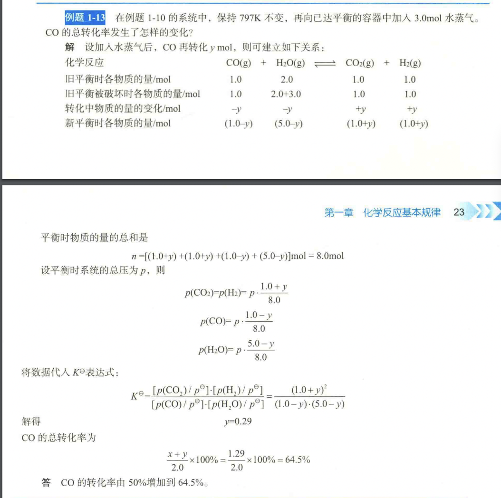

# chemistry

- [Section 1 Several basic concepts](#section-1-several-basic-concepts)
   * [System and environment](#system-and-environment)
- [Section 2 Mass Conservation and Energy Conservation in Chemical Reactions](#section-2-mass-conservation-and-energy-conservation-in-chemical-reactions)
   * [Law of Conservation of Mass in Chemical Reactions](#law-of-conservation-of-mass-in-chemical-reactions)
   * [The first law of thermodynamics,](#the-first-law-of-thermodynamics)
      + [Pressure-volume work](#pressure-volume-work)
   * [Heat of reaction of chemical reactions](#heat-of-reaction-of-chemical-reactions)
   * [Calculation of heat of reaction of chemical reactions](#calculation-of-heat-of-reaction-of-chemical-reactions)
      + [Gauss's Law](#gausss-law)
      + [Formation reaction](#formation-reaction)
      + [Calculate standard molar elthalpy ](#calculate-standard-molar-elthalpy)
- [Section 3 The direction of chemical reactions](#section-3-the-direction-of-chemical-reactions)
   * [Spontaneity of chemical reactions](#spontaneity-of-chemical-reactions)
      + [Chaos and entropy](#chaos-and-entropy)
         - [Standard molar entropy](#standard-molar-entropy)
         - [Calculate ΔSm](#calculate-sm)
   * [Gibbs function change and direction of chemical reaction](#gibbs-function-change-and-direction-of-chemical-reaction)
         - [Example of calculating ΔG](#example-of-calculating-g)
- [Section 4 The extent of chemical reactions - chemical equilibrium](#section-4-the-extent-of-chemical-reactions-chemical-equilibrium)
   * [Chemical equilibrium](#chemical-equilibrium)
      + [Law of Partial Pressure](#law-of-partial-pressure)
         - [The Law of Partial Pressure](#the-law-of-partial-pressure)
         - [Ideal Gas Mixture](#ideal-gas-mixture)
      + [Standard equilibrium constant](#standard-equilibrium-constant)
         - [Examples](#examples)
            * [First example](#first-example)
            * [Second example](#second-example)
            * [Example from book](#example-from-book)
      + [Gibbs's function and G&K relationship ](#gibbss-function-and-gk-relationship)
         - [Examples of Gibbs function calculation](#examples-of-gibbs-function-calculation)
            * [First example](#first-example-1)
            * [Example from book](#example-from-book-1)
   * [Shifts in chemical equilibrium](#shifts-in-chemical-equilibrium)
      + [The Influence of Partial Pressure and Total Pressure on Chemical Equilibrium](#the-influence-of-partial-pressure-and-total-pressure-on-chemical-equilibrium)
      + [Example of shifts in chemical equilibrium](#example-of-shifts-in-chemical-equilibrium)
         - [First example from book](#first-example-from-book)
         - [Second example from book](#second-example-from-book)
- [Section 5 Chemical Reaction Rate](#section-5-chemical-reaction-rate)
   * [How to express the rate of chemical reaction](#how-to-express-the-rate-of-chemical-reaction)
      + [Convertion rate](#convertion-rate)
      + [Extent of reaction](#extent-of-reaction)
   * [Reaction rate theory and activation energy](#reaction-rate-theory-and-activation-energy)
      + [Collision Theory](#collision-theory)
      + [Reaction rate theory](#reaction-rate-theory)
      + [Transition State Theory](#transition-state-theory)
      + [Law of mass action](#law-of-mass-action)
         - [Examples](#examples-1)
               + [The Haber-Bosch Process](#the-haber-bosch-process)
               + [The Dissociation of Hydrogen Iodide](#the-dissociation-of-hydrogen-iodide)
            * [Example from book](#example-from-book-2)
      + [Order of chemical reaction](#order-of-chemical-reaction)
      + [Catalyst](#catalyst)
      + [Factors Affecting the Rate of Heterogeneous Reactions](#factors-affecting-the-rate-of-heterogeneous-reactions)
- [Section 6 Colligative properties of dilute solutions, the vapor pressure of the solution drops](#section-6-colligative-properties-of-dilute-solutions-the-vapor-pressure-of-the-solution-drops)
   * [The boiling point of the solution increases and the freezing point decreases.](#the-boiling-point-of-the-solution-increases-and-the-freezing-point-decreases)
   * [Osmotic pressure](#osmotic-pressure)
   * [Ideal gas law](#ideal-gas-law)
- [Section 7 Acid-base proton theory](#section-7-acid-base-proton-theory)
   * [Proton transfer equilibrium constant](#proton-transfer-equilibrium-constant)
      + [Example](#example)
      + [Calculating pH](#calculating-ph)
- [Section 8 Precipitation and Dissolution Equilibrium of Insoluble Electrolytes](#section-8-precipitation-and-dissolution-equilibrium-of-insoluble-electrolytes)
   * [Solution product](#solution-product)
- [Section 9 Coordination Balance Concept, composition and naming of coordination compounds](#section-9-coordination-balance-concept-composition-and-naming-of-coordination-compounds)
- [Section 10 Redox Reaction](#section-10-redox-reaction)
- [Section 11 Galvanic cell and Electrode Potential](#section-11-galvanic-cell-and-electrode-potential)
- [Section 12 Electrolysis](#section-12-electrolysis)
- [Section 13 Corrosion and Protection of Metals](#section-13-corrosion-and-protection-of-metals)
- [Section 14 Terminus](#section-14-terminus)
   * [In English](#in-english)

# Section 1 Several basic concepts

## System and environment

The concepts of "system" and "environment" are fundamental to understanding chemical reactions and the exchange of energy and matter. Here's an explanation of these concepts:

**1. System:**
   - In chemistry, a "system" refers to a specific portion of the universe under consideration. It is the part of the world that we are studying, analyzing, or focusing on. The system can be as small as a single chemical reaction or as large as an entire chemical process.
   - The system is separated from the surrounding universe by a boundary, which can be physical (like a container) or imaginary (such as a control volume in chemical engineering).
   - A system can be an open system, closed system, or isolated system, depending on the exchange of energy and matter with the surroundings.

**2. Environment:**
   - The "environment" refers to everything outside the system. It includes everything not considered as part of the system under study.
   - The environment can exchange energy and matter with the system. This exchange can be crucial in chemical reactions, where reactants and products interact with the environment.

**Types of Systems:**
   - **Open System:** An open system can exchange both energy and matter with its surroundings. For example, a chemical reaction taking place in an open beaker where reactants can evaporate, and heat can be exchanged with the surroundings.

   - **Closed System:** In a closed system, energy can be exchanged with the surroundings (usually in the form of heat), but matter cannot enter or leave. A common example is a sealed container.

   - **Isolated System:** An isolated system can exchange neither energy nor matter with its surroundings. This is an idealized concept and rarely exists in practice. In reality, perfect isolation is challenging to achieve.

Understanding the system-environment relationship is essential in thermodynamics and chemical kinetics, as it helps describe how chemical reactions occur and how energy changes take place. The exchange of heat and matter between the system and its environment is critical in determining the behavior and properties of chemical systems.

2. Phase…

In chemistry, "phase" and "condition" are related but distinct concepts that are used to describe the state of a substance. Here's an explanation of each concept:

**1. Phase:**
- Phase refers to a physically distinct and homogeneous portion of a system with uniform properties. It is characterized by its physical state, such as solid, liquid, gas, plasma, or supercritical fluid. Each phase typically has a well-defined composition, density, and state of matter.

- Phase transitions occur when a substance changes from one phase to another, typically due to changes in temperature and pressure. For example, when water is heated, it transitions from a solid (ice) to a liquid (water) to a gas (vapor).

- Phases are separated by phase boundaries, which are often associated with specific conditions, such as the melting point, boiling point, and critical point. Phase diagrams are used to represent how phases change with variations in temperature and pressure.

**2. Condition:**
- Conditions, in the context of chemistry, refer to the specific environmental factors or parameters under which a substance or chemical reaction is studied. Conditions can include temperature, pressure, concentration, and other variables.

- Conditions are essential for understanding and controlling chemical reactions and processes. For example, reactions may be conducted under specific conditions to optimize yields or to ensure safety.

- Common conditions in chemical experiments include standard temperature and pressure (STP), which is defined as 0°C (273.15 K) and 1 atmosphere (101.3 kPa), and standard ambient temperature and pressure (SATP), which is defined as 25°C (298.15 K) and 1 atmosphere.

- Conditions can also refer to the state of a system, such as "room temperature and pressure" (RT or RTP), which is often used as a standard reference for laboratory conditions. However, the specific values associated with these conditions may vary depending on regional standards.

In summary, phases describe the physical state of a substance (e.g., solid, liquid, gas), while conditions refer to the specific parameters (e.g., temperature, pressure) under which a substance or chemical reaction is observed or conducted. Both concepts are important for understanding the behavior of matter and chemical processes.

# Section 2 Mass Conservation and Energy Conservation in Chemical Reactions
## Law of Conservation of Mass in Chemical Reactions

The Law of Conservation of Mass, also known as the Law of Mass Conservation or simply the Law of Mass, is a fundamental principle in chemistry and physics. It states that in a closed system, the total mass of the substances undergoing a chemical reaction remains constant before and after the reaction. In other words, mass is neither created nor destroyed in a chemical reaction; it is conserved.

Key points related to the Law of Conservation of Mass in chemical reactions:

1. **Mass Before and After:** The total mass of the reactants (substances undergoing the reaction) is equal to the total mass of the products (substances formed as a result of the reaction). This principle is expressed mathematically as:

   $$\[ \text{Mass of Reactants} = \text{Mass of Products} \]$$

2. **Closed System:** The law applies to closed systems, where no mass is exchanged with the surroundings. In practice, it is difficult to have a perfectly closed system, but the law remains a valuable approximation.

3. **Atoms and Molecules:** The law is based on the conservation of atoms and molecules. During a chemical reaction, atoms are rearranged into new compounds, but the total number of atoms of each element on both sides of the reaction equation remains the same.

4. **Chemical Equations:** Chemical reactions are typically represented using balanced chemical equations, which ensure that the number of atoms of each element is the same on both sides of the equation. This balance ensures the conservation of mass.

5. **Mass and Energy:** It's important to note that the law of conservation of mass does not account for changes in energy during a chemical reaction. Some reactions may release or absorb energy (exothermic or endothermic reactions), but this does not violate the conservation of mass.

The Law of Conservation of Mass was formulated by Antoine Lavoisier, a French chemist, in the late 18th century. This law is a foundational concept in chemistry and serves as the basis for stoichiometry, the study of the quantitative relationships between reactants and products in chemical reactions. It is a fundamental principle that underlies much of our understanding of the behavior of matter in chemical systems.

## The first law of thermodynamics,

The First Law of Thermodynamics, often referred to as the Law of Energy Conservation, is one of the fundamental principles in the field of thermodynamics. It states that energy cannot be created or destroyed in an isolated system; it can only change forms or be transferred from one part of the system to another. In simple terms, the total energy of a closed system remains constant.

The First Law can be expressed mathematically as follows:

$$\[ \Delta U = Q - W \]$$

Where:
- $\( \Delta U \)$ represents the change in internal energy of the system.
- $\( Q \)$ represents the heat added to the system (positive when heat is added).
- $\( W \)$ represents the work done by the system on its surroundings (positive when work is done by the system).

Key points related to the First Law of Thermodynamics:

1. **Conservation of Energy:** The First Law is a statement of the conservation of energy principle. It tells us that energy is neither created nor destroyed; it simply changes from one form to another.

2. **Internal Energy:** The change in internal energy $\( \Delta U \)$ is a measure of the total energy within the system, including both kinetic and potential energy. It is an extensive property that depends on the amount of substance in the system.

3. **Heat and Work:** The First Law accounts for the energy transferred as heat and the energy associated with work done by or on the system. Heat $(\( Q \))$ is the energy transfer due to temperature differences, while work $(\( W \))$ is the energy transfer associated with mechanical processes.

4. **Sign Convention:** The sign convention for $\( Q \)$ and $\( W \)$ depends on whether energy is being added to or taken from the system. Heat added to the system and work done by the system are considered positive.

5. **State Function:** The internal energy $(\( U \))$ is a state function, meaning it depends only on the current state of the system and not on the path taken to reach that state.

6. **Applications:** The First Law is fundamental in the study of thermodynamics and is used to analyze a wide range of processes, including chemical reactions, phase changes, and heat engines.

The First Law of Thermodynamics lays the foundation for the study of energy transformations in physical and chemical systems. It helps us understand how energy is conserved and transferred in various processes, making it a crucial principle in the field of thermodynamics.

### Pressure-volume work

Pressure-volume work, often denoted as $\(PV\)$ work, is a type of mechanical work performed by or on a system as a result of a change in its volume while it is under the influence of an external pressure. This concept is a fundamental part of thermodynamics and plays a key role in understanding processes such as gas expansion or compression.

The formula for pressure-volume work $(\(PV\)$ work) is as follows:

$$\[W = -P \Delta V\]$$
$$\(p = -\frac{W}{V_2 - V_1}\)$$

Where:
- $\(W\)$ represents the work done on or by the system.
- $\(P\)$ is the pressure of the system.
- $\(\Delta V\)$ is the change in volume of the system.

Key points related to pressure-volume work:

1. **Sign Convention:** The negative sign in the formula indicates that work is done by the system when it expands $(\(P\)$ is positive, $\(\Delta V\)$ is positive), and work is done on the system when it is compressed $(\(P\)$ is positive, $\(\Delta V\)$ is negative).

2. **Units:** In the International System of Units (SI), pressure is typically measured in pascals (Pa) and volume in cubic meters (m³). Therefore, the unit of pressure-volume work is joules (J), which is the same as the unit of energy.

3. **Expansion and Compression:** When a gas expands, it does work on its surroundings, and this work is considered positive. Conversely, when a gas is compressed, work is done on it, and this work is considered negative.

4. **Work on a Piston:** A common example of pressure-volume work is a piston-cylinder system. When a gas in the cylinder expands and pushes up on the piston, it does work on the surroundings. If the gas is compressed, work is done on it.

5. **Relation to Internal Energy:** In thermodynamics, pressure-volume work is often associated with changes in the internal energy of a system. It is one of the ways in which energy can be transferred between a system and its surroundings.

Pressure-volume work is a fundamental concept in thermodynamics and is used to analyze a wide range of processes, including heat engines, chemical reactions, and the behavior of gases. It helps quantify the energy associated with changes in the volume of a system when pressure is applied or released.

## Heat of reaction of chemical reactions

The heat of reaction, also known as the enthalpy change of a chemical reaction, is a measure of the heat energy either absorbed (endothermic reaction) or released (exothermic reaction) during a chemical reaction. It is a fundamental concept in thermodynamics and is represented by the symbol $\(ΔH\)$, where ΔH stands for the change in enthalpy.

Enthalpy $(\(H\))$ is a thermodynamic property that combines the internal energy of a system with the pressure-volume work done by or on the system. The heat of reaction can be calculated by the following equation:

$$\[ΔH = H_{\text{products}} - H_{\text{reactants}}\]$$

Key points related to the heat of reaction:

1. **Exothermic Reaction:** In an exothermic reaction, the products have lower enthalpy than the reactants. This means that the reaction releases heat energy into the surroundings. ΔH is negative for exothermic reactions.

2. **Endothermic Reaction:** In an endothermic reaction, the products have higher enthalpy than the reactants. This means that the reaction absorbs heat energy from the surroundings. ΔH is positive for endothermic reactions.

3. **Calorimetry:** The heat of reaction can be measured experimentally using calorimetry, where the heat change is determined by measuring temperature changes in a calorimeter.

4. **Standard Enthalpy of Formation (ΔHf°):** The standard heat of reaction, often denoted as ΔHf°, is the enthalpy change for the formation of one mole of a compound from its elements in their standard states. These standard states typically include 25°C and 1 atmosphere of pressure. ΔHf° values are tabulated and provide a way to calculate the heat of reaction for many chemical processes.

5. **Stoichiometry:** The heat of reaction depends on the stoichiometry of the balanced chemical equation. It is typically expressed in units such as joules per mole (J/mol) or kilojoules per mole (kJ/mol).

6. **Applications:** Knowledge of the heat of reaction is critical in various fields, including chemistry, chemical engineering, and material science. It is used to understand and control chemical processes, design chemical reactors, and optimize energy efficiency.

The heat of reaction is a fundamental concept in chemistry, and its measurement and understanding play a key role in both research and practical applications. It is essential for predicting the energy changes associated with chemical reactions and processes.

## Calculation of heat of reaction of chemical reactions

### Gauss's Law
Gauss's Law, as it is traditionally understood, deals with electric fields and electric charges, and it's not directly related to changes in enthalpy or chemical reactions. The equation you've presented, $\(\Delta H_m,1 = \Delta H_m,2 + \Delta H_m,3\)$, doesn't correspond to Gauss's Law. Instead, it seems to be a representation of the principle of conservation of enthalpy in a chemical reaction.

In the context of chemistry, the equation represents the change in enthalpy $(\(\Delta H_m\))$ for a chemical reaction. Enthalpy is a thermodynamic property that accounts for the internal energy of a system plus the pressure-volume work done by or on the system. In a chemical reaction, the change in enthalpy reflects the heat energy either absorbed (endothermic reaction, positive \(\Delta H_m\)) or released (exothermic reaction, negative $\(\Delta H_m\))$ during the reaction.

The equation $\(\Delta H_m,1 = \Delta H_m,2 + \Delta H_m,3\)$ suggests that the change in enthalpy for a particular reaction (1) is equal to the sum of the changes in enthalpy for two separate steps or reactions (2 and 3). This concept aligns with the principle of the conservation of energy, which applies to chemical reactions. In other words, the total change in enthalpy for a reaction is the algebraic sum of the changes in enthalpy for its individual steps.

However, it's essential to recognize that this equation is not a direct application of Gauss's Law, which is specific to the behavior of electric fields and charges. The equation you provided pertains to the thermodynamics of chemical reactions and the principle of conservation of enthalpy, rather than Gauss's Law.

### Formation reaction

The standard molar enthalpy of formation, often denoted as \(ΔH^\circ_f\), is a thermodynamic property that represents the change in enthalpy when one mole of a compound is formed from its elements in their standard states. It is measured under standard conditions, which typically include a temperature of 25°C and a pressure of 1 atmosphere. The standard state for elements is defined as the most stable form of the element at those conditions.

The general form of a standard molar enthalpy of formation reaction is as follows:

$$\[aA + bB + \ldots \rightarrow \text{Compound}\]$$

In this reaction:

- $\(a\), \(b\), etc.$, represent the stoichiometric coefficients of the elements or compounds on the left side of the reaction.
- "Compound" represents the compound for which you want to calculate the \(ΔH^\circ_f\) value.

Key points related to the standard molar enthalpy of formation $\(ΔH^\circ_f\)$:

1. **Standard Conditions:** $\(ΔH^\circ_f\)$ is determined under standard conditions, allowing for consistent comparisons between different compounds. The standard state conditions are defined for temperature, pressure, and the state of the elements.

2. **Enthalpy Change:** A negative $\(ΔH^\circ_f\)$ value indicates that the formation of the compound is exothermic, meaning it releases heat during the formation. A positive value signifies that the formation is endothermic, meaning it absorbs heat.

3. **Reference Point:** The $\(ΔH^\circ_f\)$ values serve as reference points for the energy content and stability of compounds. They are used to calculate the enthalpy change for chemical reactions and to determine the standard enthalpy of reaction $(\(ΔH^\circ_r\))$.

4. **Units:** The standard unit for $\(ΔH^\circ_f\)$ is typically joules per mole (J/mol) or kilojoules per mole (kJ/mol). It can also be expressed in calories per mole (cal/mol).

5. **Data Tables:** $\(ΔH^\circ_f\)$ values for a wide range of compounds are tabulated in thermodynamic data tables, making them readily available for use in thermodynamic calculations.

6. **Applications:** $\(ΔH^\circ_f\)$ values are widely used in chemistry, thermodynamics, and chemical engineering. They are essential for predicting and understanding the energetics of chemical reactions and processes.

Overall, the standard molar enthalpy of formation is a crucial concept in thermodynamics, allowing scientists and engineers to make accurate predictions about the heat changes associated with chemical reactions and to design and optimize chemical processes.

### Calculate standard molar elthalpy 

Certainly! Here's a step-by-step breakdown of the standard molar enthalpy change (\(ΔH^\circ\)) for the reaction:

$$\[CH₄(g) + 2O₂(g) → CO₂(g) + 2H₂O(l)\]$$

We'll break it down into individual formation reactions for each compound involved.

1. **Formation of CO₂(g) from its elements:**
   $\(C(s) + O₂(g) → CO₂(g)\)$
   $\(ΔH^\circ_1 = ΔH^\circ_f(\text{CO₂(g)})\)$

2. **Formation of H₂O(l) from its elements:**
   $\(H₂(g) + 0.5O₂(g) → H₂O(l)\)$
   $\(ΔH^\circ_2 = ΔH^\circ_f(\text{H₂O(l)})\)$

3. **Formation of CH₄(g) from its elements:**
   $\(C(s) + 2H₂(g) → CH₄(g)\)$
   $\(ΔH^\circ_3 = ΔH^\circ_f(\text{CH₄(g)})\)$

Now, let's calculate the \(ΔH^\circ\) for each step. You'll need the standard molar enthalpy of formation values for each compound from thermodynamic tables. These values are typically tabulated in units of kJ/mol.

For example, if you have the following standard molar enthalpy of formation values:

- $\(ΔH^\circ_f(\text{CO₂(g)}) = -393.5 kJ/mol\)$
- $\(ΔH^\circ_f(\text{H₂O(l)}) = -285.8 kJ/mol\)$
- $\(ΔH^\circ_f(\text{CH₄(g)}) = -74.8 kJ/mol\)$

You would use these values to calculate the $\(ΔH^\circ\)$ for each step. Finally, you can add up these values to find the $\(ΔH^\circ\)$ for the total reaction:

$$\[ΔH^\circ_{\text{total}} = ΔH^\circ_1 + ΔH^\circ_2 + ΔH^\circ_3\]$$

Just sum up the values, and you'll have the standard molar enthalpy change for the overall reaction: 

$$\[ΔH^\circ_{\text{total}} = [\(ΔH^\circ_f(\text{CO₂(g)}) + 2\(ΔH^\circ_f(\text{H₂O(l)}) + \(ΔH^\circ_f(\text{CH₄(g)})] = [ -393.5 - 2(-285.8) - 74.8]] = -890.3 KJ/mol$$

We using $2\(ΔH^\circ_f(\text{H₂O(l)})$ beacuse there is $\\text{2H₂O(l)}$.

# Section 3 The direction of chemical reactions

## Spontaneity of chemical reactions

The so-called spontaneous process is a process that can proceed automatically without any external force under certain conditions. The direction in which the reaction proceeds spontaneously refers to the direction in which the reaction proceeds automatically under certain conditions (constant temperature, constant pressure) without the need for external force.

Take physical processes as an example:

- Heat conduction always occurs spontaneously from high-temperature objects to low-temperature objects.
- Water always flows spontaneously from high to low.
- Gases always diffuse spontaneously from high pressure to low pressure.

And they cannot automatically reverse direction without the action of external force. Many similar examples can be given.

Whether a chemical reaction can proceed spontaneously under given conditions and to what extent it proceeds is a very important issue in scientific research and production practice. For example, for the following reaction:

$$\[A \rightleftharpoons B\]$$

If it can be determined that this reaction can spontaneously proceed to the right under given conditions, and to a greater extent, then we can concentrate our efforts on researching and developing catalysts or other means that are beneficial to this reaction to promote the realization of this process. Because this reaction can be used to eliminate the two pollutants CO and NO in automobile exhaust. If it can be proven theoretically that this reaction cannot be realized at any temperature and pressure, there is obviously no need to study how to realize this reaction, and we can instead look for other ways to purify automobile exhaust gas.

On what basis can we judge the spontaneity of a chemical reaction? People have studied a large number of physical and chemical processes and found that all spontaneous processes follow the following rules:

1. From the perspective of energy changes in the process, material systems tend to achieve the lowest energy state.
2. From the analysis of particle distribution and motion state in the system, the material system tends to achieve the maximum degree of chaos.
3. Any spontaneous process can do useful work through certain devices. For example, hydroelectric power generation uses water level differences to do electrical work through generators.

Material systems tend to achieve the lowest energy state, which means that for chemical reactions, exothermic reactions (\(ΔH < 0\)) can proceed spontaneously, which is similar to the situation where water automatically flows from high to low. Therefore, \(ΔH < 0\) is used as a criterion for the spontaneity of chemical reactions.

It seems to make sense. However, some processes, such as the melting of ice and the dissolution of KNO3 in water, are endothermic processes; for example, the decomposition of NzOs is also a strong endothermic reaction. These processes can occur spontaneously. These situations cannot be explained solely by the enthalpy change of the reaction. This is because the spontaneity of chemical reactions depends not only on the important factor of enthalpy change but also on another factor - entropy change.

Another example is the reaction in which CaCO3 decomposes to produce CO2 and CaO:

$$\[CaCO3 \rightarrow CO2 + CaO\]$$

$$\(ΔrH^\circ_m = 179.4 KJ/mol )\$$

It is non-spontaneous at the pressure of 298.15K and 100.000kPa. When the temperature rises to 1114K, the reaction becomes spontaneous. Obviously, the spontaneity of chemical reactions is also related to the temperature of the reaction.

### Chaos and entropy

In chemistry and thermodynamics, the concept of chaos and entropy are closely related. Here's an explanation based on the provided text:

**Chaos (Disorder):**
- Chaos, in the context of thermodynamics, refers to the degree of disorder in the arrangement and movement of particles that make up a system in a specified space.
- If a system has a high degree of order, it exhibits low chaos (low disorder).
- Conversely, if the system lacks order and has a high degree of disorder, it exhibits high chaos.

**Entropy:**
- In thermodynamics, the degree of disorder in a system is quantified using the state function "entropy," denoted by the symbol S.
- Entropy is a measure of the chaos or disorder of particles within a system.
- A system with low entropy values is in a state of low chaos, meaning it is more ordered.
- Conversely, a system with high entropy values is in a state of high chaos, indicating a relatively disordered state.
- Entropy is a property of a system and a state function, which means that its value depends on the system's current state.
- The entropy value changes as the state of the system changes.
- The amount of matter in a system is directly proportional to its entropy value.

**Standard Molar Entropy:**
- The standard molar entropy (S°) is the molar entropy of a substance under standard conditions.
- It is represented by the symbol S°(T), and its unit is J·K^-1·mol^-1.
- The third law of thermodynamics states that at 0 Kelvin (absolute zero), the entropy of any perfect crystal of a pure substance is zero.
- The standard molar entropy data for various substances at 298.15K are listed in tables.
- The standard molar entropy change (ΔS°) for a chemical reaction can be calculated using the standard molar entropies of the reactants and products. It is similar to the calculation of the standard molar enthalpy change.

In summary, chaos or disorder in a system is measured by its entropy. Systems with higher entropy values are more disordered, while those with lower entropy values are more ordered. Entropy is a state function that reflects the degree of chaos or disorder in a system, and it plays a crucial role in thermodynamics and the analysis of chemical reactions.

#### Standard molar entropy

Standard molar entropy (S°) is a thermodynamic property that quantifies the degree of chaos or disorder within a substance at a standard reference state. It is typically represented in units of joules per mole per kelvin (J·K⁻¹·mol⁻¹). Here are some key points about standard molar entropy:

1. **Reference State:** Standard molar entropy is measured under specific standard conditions, which include a pressure of 1 bar (100 kPa) and a temperature of 298.15 K (25°C).

2. **State Function:** Like other thermodynamic properties such as enthalpy and Gibbs free energy, entropy is a state function. This means that its value depends only on the current state of the substance and not on the path taken to reach that state.

3. **Entropy and Disorder:** Entropy is often associated with the degree of disorder or chaos within a system. A substance with a higher standard molar entropy has a greater degree of disorder.

4. **Third Law of Thermodynamics:** According to the third law of thermodynamics, the standard molar entropy of a perfect crystal of a pure substance is zero at absolute zero temperature (0 K). This law provides a reference point for entropy measurements.

5. **Calculation:** The standard molar entropy of a substance is determined by measuring its heat capacity at various temperatures and integrating the data to obtain the entropy change. The entropy of a substance at any temperature can be calculated using this data.

6. **Use in Thermodynamics:** Standard molar entropy is a critical parameter in thermodynamics and is used in various thermodynamic calculations, including those related to Gibbs free energy, equilibrium constants, and chemical reactions.

7. **Comparison:** By comparing the standard molar entropy values of reactants and products in a chemical reaction, you can determine whether the reaction results in an increase or decrease in the degree of disorder (entropy change).

Standard molar entropy values for various substances are tabulated and readily available for use in thermodynamic calculations. These values help chemists and physicists understand the behavior of substances under different conditions and are essential in the study of chemical reactions and phase changes.
#### Calculate ΔSm

The change in molar entropy $(\(ΔS_m\))$ for a chemical reaction can be calculated using the following general equation:

$$\[ΔS_m = ΣS_m(products) - ΣS_m(reactants)\]$$

Where:
- $\(ΔS_m\)$ is the change in molar entropy.
- $\(ΣS_m(products)\)$ is the sum of the standard molar entropies of the products.
- $\(ΣS_m(reactants)\)$ is the sum of the standard molar entropies of the reactants.

Here are the steps to calculate ΔSm:

1. **Identify the Products and Reactants:** Determine the products and reactants involved in the chemical reaction.

2. **Look Up Standard Molar Entropy Values:** Find the standard molar entropy $(\(S_m\))$ values for each of the products and reactants. These values are often tabulated in reference books or online databases. Make sure the values you use are at the same reference state, typically 298.15 K (25°C) and 1 bar (100 kPa) pressure.

3. **Sum the Molar Entropies:** Calculate the sum of the standard molar entropies for the products and reactants, based on the stoichiometric coefficients of the balanced chemical equation. Multiply each molar entropy by its coefficient in the balanced equation and then sum them up.

4. **Calculate $\(ΔS_m\)$:** Subtract the sum of the standard molar entropies of the reactants from the sum of the standard molar entropies of the products. The result is the change in molar entropy for the reaction.

5. **Check Units:** Ensure that the units of the molar entropies are consistent. The result should have units of J·K⁻¹·mol⁻¹.

6. **Account for Phase Changes:** Be aware that phase changes (e.g., solid to liquid, liquid to gas) can significantly affect molar entropy. Include these phase changes in your calculations.

7. **Consider the Third Law of Thermodynamics:** If any of the reactants or products are elemental solids or crystals at absolute zero temperature (0 K), their standard molar entropy is defined as zero. Be sure to account for this.

Calculating $\(ΔS_m\)$ is useful for understanding the entropy changes associated with chemical reactions and their spontaneity. It provides valuable information about whether a reaction tends to proceed in the direction of increased or decreased disorder or chaos.

## Gibbs function change and direction of chemical reaction

The change in Gibbs free energy $(\(ΔG\))$ plays a crucial role in determining the direction of a chemical reaction. Gibbs free energy is a thermodynamic potential that combines the enthalpy $(\(ΔH\))$ and the entropy $(\(ΔS\))$ of a system. The relationship between \(ΔG\), \(ΔH\), and \(ΔS\) is given by the Gibbs-Helmholtz equation:

$$\[ΔG = ΔH - TΔS\]$$

Where:
- $\(ΔG\)$ is the change in Gibbs free energy.
- $\(ΔH\)$ is the change in enthalpy.
- $\(ΔS\)$ is the change in entropy.
- $\(T\)$ is the absolute temperature in Kelvin.

The sign of $\(ΔG\)$ determines the spontaneity and direction of a chemical reaction:

1. **ΔG < 0 (Negative):** If $\(ΔG\)$ is negative, the reaction is said to be "spontaneous" in the forward direction. This means the reaction will tend to proceed from reactants to products without any external intervention. It is an exergonic reaction.

2. **ΔG > 0 (Positive):** If $\(ΔG\)$ is positive, the reaction is "non-spontaneous" in the forward direction. The reverse reaction is favored. Energy must be supplied to make the reaction occur. It is an endergonic reaction.

3. **ΔG = 0:** When $\(ΔG\)$ is zero, the reaction is at equilibrium. There is no net change in the concentrations of reactants and products. The system is in a state of dynamic equilibrium, and the rates of the forward and reverse reactions are equal.

The relationship between $\(ΔG\)$ and the direction of a chemical reaction is summarized in the Gibbs free energy change $(\(ΔG\))$ equation:

$$\[ΔG = ΔH - TΔS\]$$

- If $\(ΔG\)$ is negative (ΔH is negative and TΔS is smaller), the reaction is spontaneous in the forward direction.
- If $\(ΔG\)$ is positive (ΔH is positive and TΔS is larger), the reaction is non-spontaneous in the forward direction.
- If $\(ΔG\)$ is zero (ΔH equals TΔS), the reaction is at equilibrium.

The Gibbs free energy change is a fundamental concept in chemical thermodynamics, helping us understand the direction and spontaneity of chemical reactions. It takes into account both the enthalpy change (heat exchange) and the entropy change (disorder) in a system.

#### Example of calculating ΔG

# Section 4 The extent of chemical reactions - chemical equilibrium

## Chemical equilibrium

### Law of Partial Pressure

When discussing chemical equilibrium, we often encounter a mixture system of several gases. To do this, let's first discuss the law of partial pressure of gases.

#### The Law of Partial Pressure

In a gas-phase reaction, the reactants and products are in the same gas mixture. At this time, the molecules of each component gas will collide with the wall of the container and generate pressure. This pressure is called the partial pressure of the component gas. For an ideal gas, the partial pressure of a component gas is equal to the pressure produced when the component gas alone occupies the same volume as the gas mixture under isothermal conditions. Under appropriate conditions, real gases can be approximately regarded as ideal gases.

For example, a container with a volume of 1 L contains a gas mixture consisting of N2 and O2. If the O2 in this container is removed, the remaining pressure is 79 kPa; if the N2 in the container is removed, the remaining O2 pressure is 21 kPa. Then the partial pressure of N2 in the above gas mixture is p(N2) = 79 kPa, and the partial pressure of O2 is p(O2) = 21 kPa.

When several different gases are mixed into a gas mixture, the total pressure of the gas mixture is equal to the sum of the partial pressures of the component gases (for example, in the above example, the total pressure of the gas in the container is 100 kPa). This is Dalton's Law of Partial Pressure of Gas, proposed by J. Dalton in 1807.

#### Ideal Gas Mixture

Consider an ideal gas mixture containing two components A and B. Among them, the amount of substance in component A is $n_A\$, and component B is amount of substance is $n_s$. Under constant temperature and constant volume conditions, their respective equations of state are:

$\[p_aV = n_aRT\]$

$\[p_bV = n_bRT\]$

or just:

$\[pV = nRT\]$

Here's what each symbol represents in this equation:

- **p**: The pressure of a gas (in pascals, Pa).
- **V**: The volume of the gas (in cubic meters, m³).
- **$n_a$**: The number of moles of a specific component of the gas (sometimes represented as $n_1$ or $n_A$).
- **R**: The ideal gas constant, approximately 8.314 J/(mol·K) (joules per mole-kelvin).
- **T**: The absolute temperature of the gas (in kelvin, K).

This equation is similar to the ideal gas law, which relates the pressure, volume, number of moles, gas constant, and temperature of an ideal gas. However, in your equation, it specifies the number of moles for a particular component of the gas, represented as n_a. This can be useful when dealing with gas mixtures to analyze the behavior of individual gas components.

### Standard equilibrium constant
The standard equilibrium constant, often denoted as $\(K^\circ\)$, is a thermodynamic constant that describes the equilibrium position of a chemical reaction at standard conditions. It is used to quantitatively express the extent to which a chemical reaction proceeds at equilibrium. The standard conditions typically refer to a temperature of 298.15 K (25°C) and a pressure of 1 bar (100 kPa).

The standard equilibrium constant is defined for a chemical reaction in the following general form:

$$\[aA + bB \rightleftharpoons cC + dD\]$$

Where:
- $\(a\)$, $\(b\)$, $\(c\)$, and $\(d\)$ are the stoichiometric coefficients of the reactants (A and B) and products (C and D) in the balanced chemical equation.
- $\(K^\circ\)$ is the standard equilibrium constant for this reaction.

The expression for the standard equilibrium constant, $\(K^\circ\)$, is based on the law of mass action and is given by:

$$\[K^\circ = \frac{{[C]^c [D]^d}}{{[A]^a [B]^b}}\]$$

In this equation, square brackets $\([ ]\)$ denote the molar concentrations of the species involved in the reaction. Note that the standard equilibrium constant is dimensionless, as the concentrations are typically expressed in moles per liter (M or mol/L).

The value of $\(K^\circ\)$ provides important information about the position of the equilibrium for a specific reaction at standard conditions:

1. If $\(K^\circ > 1\)$, it indicates that the equilibrium position lies far to the right, favoring the products (C and D).
2. If $\(K^\circ < 1\)$, it suggests that the equilibrium position is shifted to the left, favoring the reactants (A and B).
3. If $\(K^\circ = 1\)$, it implies that the concentrations of the products and reactants are roughly equal at equilibrium.

The standard equilibrium constant is particularly useful for comparing the relative equilibrium positions of different reactions and for predicting the direction in which a reaction will proceed to reach equilibrium. It is a fundamental concept in chemical thermodynamics and plays a key role in understanding chemical equilibria.

#### Examples

##### First example

Certainly, I can provide an example of how to calculate the standard equilibrium constant (K) for a chemical reaction. Let's consider the following reaction:

$$N2(g) + 3H2(g) ⇌ 2NH3(g)$$

This is the balanced equation for the synthesis of ammonia (NH3) from nitrogen (N2) and hydrogen (H2) gases. The standard equilibrium constant (K) for this reaction is expressed as follows:

$$K = [NH3]^2 / ([N2] * [H2]^3)$$

Where:
- $[NH3]$, $[N2]$, and $[H2]$ represent the molar concentrations of ammonia, nitrogen, and hydrogen, respectively.

To calculate K at a specific temperature (usually 298 K or 25°C), you would need the molar concentrations of these gases at equilibrium.

Suppose, at 298 K, the molar concentrations at equilibrium are as follows:
$[NH3] = 1.5 M (moles per liter)$
$[N2] = 0.2 M$
$[H2] = 0.5 M$

Now, you can plug these values into the equation to calculate K:

$K = (1.5)^2 / (0.2 * (0.5)^3)$

$K = 2.25 / (0.2 * 0.125)$

$K = 2.25 / 0.025$

$K = 90$

So, at 298 K, the standard equilibrium constant (K) for this reaction is equal to 90.

This value of K indicates that, at equilibrium and at 298 K, the reaction favors the formation of ammonia (NH3), as K is much greater than 1.

##### Second example

Certainly, here's an example of how to calculate the standard equilibrium constant (K) for a different chemical reaction:

Let's consider the reaction between carbon monoxide (CO) and hydrogen gas (H2) to produce methanol (CH3OH):

$$CO(g) + 2H2(g) ⇌ CH3OH(g)$$

The standard equilibrium constant (K) for this reaction is given by:

$$K = [CH3OH] / ([CO] * [H2]^2)$$

Suppose, at a certain temperature, the molar concentrations at equilibrium are as follows:

$[CH3OH] = 0.05 M$
$[CO] = 0.1 M$
$[H2] = 0.2 M$

Now, let's calculate K:

$K = 0.05 / (0.1 * 0.2^2)$
$K = 0.05 / (0.1 * 0.04)$
$K = 0.05 / 0.004$
$K = 12.5$

So, at that specific temperature, the standard equilibrium constant (K) for this reaction is equal to 12.5. This indicates that the equilibrium significantly favors the formation of methanol (CH3OH) under those conditions.

##### Example from book

### Gibbs's function and G&K relationship 

Certainly, let's discuss the relationship between the standard Gibbs function change (ΔG°) and the standard equilibrium constant (K) for a chemical reaction.

The standard Gibbs function change (ΔG°) is a thermodynamic property that describes the change in the Gibbs free energy of a chemical system during a reaction under standard conditions (usually at 25°C and 1 atm pressure). The Gibbs free energy change for a chemical reaction is a key factor in determining whether a reaction is spontaneous or non-spontaneous.

The standard equilibrium constant (K) is a measure of the extent to which a chemical reaction proceeds to reach equilibrium under standard conditions. It is related to the concentrations of products and reactants at equilibrium. The expression for K depends on the balanced chemical equation for the reaction.

The relationship between ΔG° and K can be expressed as follows:

$$ΔG_m°(T)° = -RT * ln(K)$$

$$ln(K) = -ΔG_m°(T) / RT$$

$$lg(K) = -ΔG_m°(T) / 2.303RT$$

$$ΔG_m°(T) = -RT ln(K°) + RT ln(Пв(p_B/p°)^v_B)$$

Where:
- $ΔG°$ is the standard Gibbs free energy change.
- $R$ is the ideal gas constant (8.314 J/(mol·K) or 0.008314 kJ/(mol·K)).
- $T$ is the temperature in Kelvin.
- $K$ is the standard equilibrium constant.
- $Пв$ represents the vapor pressure.
- $v_B$ represents the coefficient of the component B in the balanced chemical equation (moles of B).

This equation tells us that the sign of $ΔG°$ determines the spontaneity of a reaction:
- If $ΔG° < 0 (negative)$, the reaction is spontaneous, and $K > 1$.
- If $ΔG° = 0$, the reaction is at equilibrium, and $K = 1$.
- If $ΔG° > 0 (positive)$, the reaction is non-spontaneous, and $K < 1$.

In other words, the standard Gibbs free energy change for a reaction is related to the position of the equilibrium (as indicated by K). If ΔG° is negative, the reaction will proceed in the forward direction (toward products) to reach equilibrium. If ΔG° is positive, the reverse reaction is favored.

So, the standard Gibbs function change and the standard equilibrium constant are related through the equation mentioned above, which helps us understand the spontaneity and direction of chemical reactions under standard conditions.

#### Examples of Gibbs function calculation

##### First example

Sure, I'll provide an example of how to calculate the standard Gibbs function change (ΔG°) and the standard equilibrium constant (K) for a chemical reaction.

**Example: The Decomposition of Hydrogen Peroxide**
Let's consider the decomposition of hydrogen peroxide (H₂O₂) into water (H₂O) and oxygen (O₂):

2 H₂O₂(l) ⇌ 2 H₂O(l) + O₂(g)

We want to calculate ΔG° and K for this reaction at 25°C (298.15 K).

**Step 1: Calculate ΔG°**
To calculate ΔG°, we use the following equation:

$$ΔG° = ΣΔG°f(products) - ΣΔG°f(reactants)$$

1. The standard Gibbs free energy of formation (ΔG°f) values for water and oxygen are known:
   - $ΔG°f(H₂O) = -237.1 kJ/mol$
   - $ΔG°f(O₂) = 0 kJ/mol$ (since O₂ in its standard state has ΔG°f = 0)

2. The standard Gibbs free energy of formation of hydrogen peroxide is not explicitly provided, but we can look it up in tables. It is approximately -118.6 kJ/mol.

Now we can calculate ΔG°:

$ΔG° = [2 * ΔG°f(H₂O) + ΔG°f(O₂)] - [2 * ΔG°f(H₂O₂)]$
$ΔG° = [2 * (-237.1 kJ/mol) + 0 kJ/mol] - [2 * (-118.6 kJ/mol)]$
$ΔG° ≈ (-474.2 kJ/mol) - (-237.2 kJ/mol)$
$ΔG° ≈ -237 kJ/mol$

**Step 2: Calculate K**
To calculate K, we use the equation:

$$ΔG° = -RT * ln(K)$$

R is the ideal gas constant (8.314 J/(mol·K)), and T is the temperature in Kelvin (298.15 K). ΔG° is already calculated as -237 kJ/mol.

$-237 kJ/mol = - (8.314 J/(mol·K) * 298.15 K) * ln(K)$

Now, solve for ln(K):

$ln(K) = (237,000 J) / [(8.314 J/(mol·K) * 298.15 K)]$
$ln(K) ≈ 31.44$

Finally, calculate K by taking the exponential of ln(K):

$K = e^(ln(K))$
$K ≈ e^(31.44)$
$K ≈ 1.41 x 10^13$

So, for the decomposition of hydrogen peroxide at 25°C, K is approximately 1.41 x 10^13, indicating that the reaction strongly favors the formation of water and oxygen.

This example demonstrates how to calculate ΔG° and K for a chemical reaction under standard conditions. The values of ΔG°f for reactants and products are essential for such calculations.
##### Example from book

## Shifts in chemical equilibrium

The process of converting a reversible reaction from one equilibrium state to another due to changes in external conditions is called a shift in chemical equilibrium. When the system moves from an old equilibrium state to a new equilibrium state, the concentration of each substance is different from the original equilibrium state. Therefore, the equilibrium movement can be judged by the changes in concentration (partial pressure) in the two equilibrium states:

- If the concentration (partial pressure) of the reactant is greater than when the equilibrium is destroyed, it is defined as the equilibrium moving in the direction of the forward reaction (or to the right).
- If the concentration (partial pressure) of the reactant is greater than when the equilibrium is destroyed, it is defined as equilibrium moving in the opposite reaction direction (or to the left).

### The Influence of Partial Pressure and Total Pressure on Chemical Equilibrium

The premise for studying how the chemical equilibrium moves due to the partial pressure or total pressure of the component gases in a gas reaction system is that the temperature remains constant. In this way, the standard equilibrium constant (K) is an unchanging fixed value.

If a certain reactant is added to the original equilibrium system, the reaction will proceed in the forward direction, that is, the equilibrium will move to the right. Conversely, if a certain product is added to the original equilibrium system, the reaction will proceed in the reverse direction, that is, equilibrium will move to the left. This situation can be confirmed by quantitative calculations.

### Example of shifts in chemical equilibrium

#### First example from book

#### Second example from book

# Section 5 Chemical Reaction Rate

The rate of a chemical reaction refers to how quickly reactants are transformed into products over time. Several factors influence the rate of chemical reactions:

1. **Concentration of Reactants:** Increasing the concentration of reactants typically leads to a higher reaction rate because there are more particles available to collide and react.

2. **Temperature:** Higher temperatures generally result in faster reaction rates. This is because higher temperatures lead to greater kinetic energy, increasing the frequency and energy of collisions between reactant particles.

3. **Surface Area:** In reactions involving solids, the surface area of the solid can impact the rate. Finely powdered or granulated solids have a larger surface area and, therefore, faster reaction rates compared to large chunks.

4. **Pressure:** Pressure can affect the reaction rate, especially in gas-phase reactions. Increasing pressure typically results in faster reactions because gas particles are compressed, leading to more frequent collisions.

5. **Catalysts:** Catalysts are substances that can speed up chemical reactions without being consumed in the process. They provide an alternative reaction pathway with lower activation energy, allowing reactions to occur more rapidly.

6. **Nature of Reactants:** The chemical nature of the reactants matters. Some reactions inherently occur faster due to the nature of the compounds involved.

7. **Activation Energy:** The activation energy is the energy barrier that reactant particles must overcome to transform into products. Lowering the activation energy can increase the reaction rate.

8. **Orientation of Collisions:** For reactions involving molecules, the orientation of collisions matters. Not all collisions result in a reaction; only those with the correct orientation and sufficient energy lead to product formation.

9. **Solvent:** In reactions that occur in a solvent (e.g., liquid-phase reactions), the nature of the solvent can affect the rate. It can stabilize or destabilize reactants or intermediates.

10. **Light and Radiation:** Some reactions are influenced by exposure to light or radiation. These energy sources can either speed up or slow down reactions, depending on the reaction type.

Understanding these factors helps scientists and chemists control and optimize chemical reactions for various applications, from industrial processes to laboratory experiments. The study of reaction kinetics focuses on quantifying and predicting reaction rates under specific conditions.

## How to express the rate of chemical reaction

The rate of a chemical reaction is typically expressed using one of the following methods:

1. **Change in Concentration over Time:** This is the most common way to express the rate of a reaction. It's represented as the change in concentration of a reactant or product per unit of time. The rate is often expressed as:
  $$aA + bB = gG + dD$$

   $$\[ \text{Rate} \text{ or} \text{ v} = -\frac{1}{a} \frac{\Delta [A]}{\Delta t} = \frac{1}{b} \frac{\Delta [B]}{\Delta t} = \frac{1}{c} \frac{\Delta [C]}{\Delta t} = -\frac{1}{d} \frac{\Delta [D]}{\Delta t} \]$$

   Where $\([A]\)$, $\([B]\)$, $\([C]\)$, and $\([D]\)$ are the molar concentrations of the reactants and products in the reaction, $\(\Delta [A]\), \(\Delta [B]\), \(\Delta [C]\), and \(\Delta [D]\)$ are the changes in concentrations over a specified time period $\(\Delta t\), and \(a\), \(b\), \(c\), and \(d\)$ are the coefficients in the balanced chemical equation.

1. **Rate of Disappearance of Reactants or Formation of Products:** This expression specifies whether you're monitoring the decrease in the concentration of reactants or the increase in the concentration of products. For reactants, it's the negative of the rate; for products, it's the positive rate.

2. **Rate of Formation of Products:** If you're interested in the rate at which products are formed, you express the rate positively for the products.

3. **Average Rate:** Sometimes, you're given the initial and final concentrations of reactants or products. In such cases, you can calculate the average rate using the formula:

   $$\[ \text{Average Rate} = \frac{\text{Change in Concentration}}{\text{Change in Time}} \]$$

4. **Rate in Terms of Gas Pressure:** For gas-phase reactions, you can express the rate in terms of the change in gas pressure over time. This is especially relevant for gas reactions, such as those in a closed container.

5. **Rate in Terms of Volume of Gas Evolved:** In reactions where a gas is evolved, you can express the rate in terms of the volume of gas produced per unit time.

6. **Rate in Terms of Reaction Progress:** For some reactions, it's more convenient to express the rate in terms of the extent of reaction, which is measured in terms of the reactants consumed or products formed. This is often used for reactions that don't have easily measurable concentrations.

The choice of how to express the rate depends on the specific details of the reaction and the information you have. In many cases, the rate is expressed in terms of concentration changes because it provides a direct and quantitative measure of reaction progress. The coefficients in the balanced chemical equation are used to relate the rates of change of reactants and products.

### Convertion rate

In the context of chemical reactions, the term "conversion rate" typically refers to the extent to which a reactant has been converted into products over a specific period of time. It is a measure of the progress of a chemical reaction and can be expressed as a ratio or percentage.

The formula for calculating the conversion rate of a chemical reaction is as follows:

$$\[ \text{Conversion Rate} \text{ or} \text{ ξ} = \frac{\text{Amount of Reactant Consumed}}{\text{Initial Amount of Reactant}} \times 100\% \]$$

In this formula:

- "Amount of Reactant Consumed" is the quantity of the reactant that has been transformed into products during the reaction.
- "Initial Amount of Reactant" is the initial quantity of the reactant present before the reaction began.

The conversion rate is usually expressed as a percentage, indicating how much of the reactant has been converted into products. A higher conversion rate indicates that a larger portion of the reactant has undergone the chemical transformation.

Chemists use conversion rates to monitor the progress of reactions, optimize reaction conditions, and determine the yield of desired products. It's a crucial parameter in chemical kinetics, especially in industrial processes and laboratory experiments, where controlling and maximizing the conversion rate is essential for efficiency and product quality.

For example, if you start with 100 grams of a reactant, and after a certain period, 40 grams of the reactant have been converted into products, the conversion rate would be:

$$\[ \text{ξ} = \frac{40 \, \text{g}}{100 \, \text{g}} \times 100\% = 40\% \]$$

This means that 40% of the initial reactant has been converted into products.

### Extent of reaction

The extent of reaction, often denoted by the symbol ξ (xi), is a concept used in chemical kinetics to quantify the progress of a chemical reaction. It measures the change in the amount of reactants and products as a reaction proceeds from its initial state to its equilibrium state. The extent of reaction is a crucial parameter for describing reaction progress and calculating reaction rates.

The extent of reaction is defined based on the stoichiometry of a chemical reaction, which describes the balanced ratio of reactants and products in a chemical equation. For a generic chemical reaction of the form:

$$\[ aA + bB \rightarrow cC + dD \]$$

The extent of reaction (ξ) is related to the changes in the amounts of reactants (A and B) and products (C and D) over time. It can be expressed as follows:

$$\[ \xi = -\frac{\Delta n_A}{a} = -\frac{\Delta n_B}{b} = \frac{\Delta n_C}{c} = \frac{\Delta n_D}{d} \]$$

In this equation:

- ξ is the extent of reaction.
- $Δn_A, Δn_B, Δn_C, \text{ and } Δn_D$ represent the changes in the number of moles of each species (A, B, C, and D) as the reaction progresses.
- $a, b, c, \text{ and } d$ are the stoichiometric coefficients of each species in the balanced chemical equation.

The extent of reaction can be used to calculate reaction rates and track the changes in the concentrations of reactants and products as the reaction proceeds. It is particularly useful for understanding how the reaction progresses toward equilibrium, which occurs when ξ reaches a maximum value, and the reaction rates of the forward and reverse reactions become equal.

Chemical kinetics and reaction mechanisms are often studied using the concept of the extent of reaction to determine reaction rates and understand the factors that influence reaction progress. It plays a fundamental role in analyzing and modeling chemical reactions in various fields of chemistry and chemical engineering.

## Reaction rate theory and activation energy

The rate of a chemical reaction depends first on the nature of the reactants. In addition, the reaction rate is also related to external conditions such as the concentration of reactants, temperature, and catalyst. In order to explain these problems, it is necessary to introduce the concepts of reaction rate theory and activation energy.

### Collision Theory

The necessary condition for a chemical reaction to occur is the collision between reactant molecules (or atoms, ions). However, among the countless collisions of reactant molecules, only a very small number of collisions can cause reactions, and the vast majority of collisions are "ineffective."

In order to explain this phenomenon, people put forward the concept of "effective collision." In chemical reactions, the collision of most reactant molecules does not cause a reaction, and only a certain number of collisions between a small number of molecules can cause a reaction. These reactive collisions are called effective collisions. Obviously, the greater the number of effective collisions, the faster the reaction rate.

The main difference between molecules that can effectively collide and ordinary molecules is the energy they possess. Only those molecules with sufficiently high energy can effectively collide and thus undergo chemical reactions. Such molecules are called activated molecules. The difference between the lowest energy of the activated molecules and the average energy of the molecules in the reaction system is called the activation energy (Ea) of the reaction.

The activation energy is closely related to the reaction rate. At a certain temperature, the greater the activation energy of the reaction, the smaller the fraction of activated molecules (proportion to the total number of reactant molecules), the fewer the number of effective collisions, and the slower the reaction rate. Conversely, the smaller the activation energy of the reaction, the greater the fraction of activated molecules, and the faster the reaction rate.

The activation energy can be measured experimentally. The activation energy of general chemical reactions is 60~250 kJ·mol⁻¹. The reaction rate with activation energy less than 40 kJ·mol⁻¹ is very fast and can be completed instantly, such as a neutralization reaction. On the other hand, when the activation energy is greater than 400 kJ·mol⁻¹, the reaction rate is very slow. Table 1-4 lists the activation energies of some reactions.

### Reaction rate theory

Reaction rate theory often referred to as chemical kinetics, is a branch of chemistry that deals with the study of the rates at which chemical reactions occur. It seeks to understand the factors influencing the speed of reactions and the mechanisms by which reactions take place. One key concept in reaction rate theory is activation energy.

**Activation Energy (Ea):** Activation energy is the minimum amount of energy that reactant molecules must possess to undergo a chemical reaction. It's the energy required to break the existing chemical bonds in reactant molecules and initiate the formation of new bonds to produce products. Activation energy is a fundamental concept in chemical kinetics because it provides insights into the reaction's speed and the energy barriers that must be overcome.

Here's how activation energy relates to reaction rate theory:

1. **Reaction Rate Equation:** The rate of a chemical reaction can be expressed mathematically. A common form of the rate equation is the Arrhenius equation:

   $\[k = A e^{-\frac{E_a}{RT}}\]$

   $ln(\frac{k}{\[k\]}) = -\frac{(E_a)}{RT} + ln(\frac{A}{\[A\]})$

   Where:
   - $\(k\)$ is the rate constant.
   - $\(A\)$ is the pre-exponential factor.
   - $\(E_a\)$ is the activation energy.
   - $\(R\)$ is the ideal gas constant.
   - $\(T\)$ is the temperature in Kelvin.

3. **Effect on Reaction Rate:** The activation energy $(\(E_a\))$ plays a crucial role in determining the rate of a reaction. A higher activation energy means that reactant molecules must possess more energy to overcome the energy barrier, which leads to a slower reaction rate. Conversely, a lower activation energy allows reactions to occur more rapidly.

4. **Catalysis:** Catalysts are substances that lower the activation energy of a reaction, providing an alternative, lower-energy pathway for the reaction. This results in an increased reaction rate. Catalysts enable reactions to occur under milder conditions or at a faster pace.

5. **Temperature Dependence:** Temperature strongly influences reaction rates. As temperature increases, the kinetic energy of reactant molecules also increases, leading to more frequent and energetic collisions. This, in turn, increases the likelihood of molecules having enough energy to surpass the activation energy barrier.

In summary, activation energy is a critical parameter in reaction rate theory, affecting how quickly a reaction occurs and providing insights into the energy required for reactants to transform into products. The concept of activation energy is particularly important for understanding the relationship between reaction rate, temperature, and catalysts in chemical kinetics.

Here's the provided text converted to markdown format:

### Transition State Theory

Transition state theory believes that chemical reactions cannot be completed only through simple collisions between reactant molecules. During the reaction, an intermediate transition state is passed, which means that the reactant molecules first form an activated complex. Therefore, transition state theory is also called activated complex theory.

For example, in the reaction of CO and NO₂, when the CO and NO₂ molecules with higher energy approach each other to a certain extent with appropriate orientation, the valence electron clouds can penetrate each other to form an activated complex. In the activated complex, the original NO bonds are partially broken, and new CO bonds are partially formed:

**Activated Complex (Transition State)**

In this case, the kinetic energy of the reactant molecules is temporarily converted into potential energy. The generated activated complex is extremely unstable and will decompose once formed. It can be decomposed into the products NO and CO₂ or the reactants CO and NO₂. Therefore, the activated complex is a transition state.

During the entire reaction process of the system $NO₂ + CO → NO + CO₂$, the changes in potential energy are shown in Figure 1-5. Point 4 represents the average potential energy of the NO + CO system. Under this condition, NO₂ and CO molecules do not react with each other. When the potential energy reaches point B, an activated complex is formed. Point C is the average potential energy of the product NO + CO₂ system.

In transition state theory, the difference between the lowest potential energy of the activated complex and the average potential energy of the reactant molecules is called the activation energy. As can be seen from Figure 1-5, E₁at is the activation energy of the above forward reaction, and E₂at is the activation energy of the reverse reaction. The difference between E₁at and E₂at is the thermal effect of the chemical reaction △H. For this reaction, E₁at < E₂at, so the forward reaction is exothermic, and the reverse reaction is endothermic.

### Law of mass action

The law of mass action is a fundamental principle in chemistry and chemical equilibrium that describes the relationship between the concentrations of reactants and products in a chemical reaction at equilibrium. It was formulated independently by Cato Maximilian Guldberg and Peter Waage in the 19th century.

The law of mass action states that the rate of a chemical reaction is directly proportional to the product of the concentrations (or activities) of the reactants, each raised to the power of their respective stoichiometric coefficients in the balanced chemical equation. Mathematically, the law can be expressed as follows for a generic chemical reaction:

$$aA + bB ⇌ cC + dD$$

Where:
- $a, b, c, \text{ and } d$ are the stoichiometric coefficients of the reactants (A and B) and products (C and D) in the balanced chemical equation.
- $[A], [B], [C], \text{ and } [D]$ represent the concentrations (or activities) of A, B, C, and D at equilibrium.

The law of mass action equation can be written as:

$$\[ \text{Rate} \text{ or } \text{ v} = k \cdot [A]^a \cdot [B]^b \]$$

Where:
- Rate is the rate of the chemical reaction.
- k is the rate constant or rate coefficient.
- [A] and [B] are the concentrations (or activities) of the reactants A and B, respectively.
- a and b are the stoichiometric coefficients of A and B in the chemical equation.

The law of mass action is particularly useful in understanding and predicting how changes in reactant concentrations affect the equilibrium position of a reaction. For example, if the concentration of a reactant is increased, the reaction may shift to the right (toward the product side) to re-establish equilibrium. Conversely, a decrease in reactant concentration can cause a shift in the opposite direction.

This principle plays a central role in the study of chemical equilibrium and is the foundation for understanding equilibrium constants (Kc or Kp), which provide a quantitative measure of the extent of a chemical reaction at equilibrium.

#### Examples

Certainly! Let's calculate the equilibrium constants (Kc) for two different chemical reactions using the law of mass action.

###### The Haber-Bosch Process

The Haber-Bosch process is used to produce ammonia (NH3) from nitrogen (N2) and hydrogen (H2) gases. The balanced chemical equation for this reaction is:

$$\[ N2(g) + 3H2(g) \rightleftharpoons 2NH3(g) \]$$

Here, a = 1, b = 3, c = 2, and d = 1 based on the coefficients in the reaction equation. Let's assume the following equilibrium concentrations (molarities):

- $\([N2] = 0.5 \, \text{M}\)$
- $\([H2] = 0.2 \, \text{M}\)$
- $\([NH3] = 0.1 \, \text{M}\)$

We can calculate Kc using the law of mass action:

$\[ Kc = \dfrac{[NH3]^2}{[N2] \cdot [H2]^3} \]$
$\[ Kc = \dfrac{(0.1)^2}{0.5 \cdot (0.2)^3} \]$
$\[ Kc = \dfrac{0.01}{0.5 \cdot 0.008} \]$
$\[ Kc = \dfrac{0.01}{0.004} \]$
$\[ Kc = 2.5 \, \text{M}^{-1} \]$

So, for the Haber-Bosch process, Kc is equal to 2.5 M^(-1).

###### The Dissociation of Hydrogen Iodide

The balanced chemical equation for the dissociation of hydrogen iodide (HI) is as follows:

$$\[ 2HI(g) \rightleftharpoons H2(g) + I2(g) \]$$

Here, a = 2, b = 1, c = 1, and d = 1. Let's assume the following equilibrium concentrations (molarities):

- $\([HI] = 0.2 \, \text{M}\)$
- $\([H2] = 0.1 \, \text{M}\)$
- $\([I2] = 0.1 \, \text{M}\)$

We can calculate Kc using the law of mass action:

$\[ Kc = \dfrac{[H2] \cdot [I2]}{[HI]^2} \]$
$\[ Kc = \dfrac{(0.1) \cdot (0.1)}{(0.2)^2} \]$
$\[ Kc = \dfrac{0.01}{0.04} \]$
$\[ Kc = 0.25 \, \text{M}^{-1} \]$

So, for the dissociation of hydrogen iodide, Kc is equal to 0.25 M^(-1).

These examples demonstrate how to calculate the equilibrium constant (Kc) for chemical reactions using the law of mass action and given equilibrium concentrations. The value of Kc provides information about the position of the equilibrium in each reaction.

##### Example from book

### Order of chemical reaction

The order of a chemical reaction refers to the mathematical relationship between the rate of the reaction and the concentrations of reactants. It is determined experimentally and can provide insights into the reaction mechanism and kinetics. The order of a reaction can be zero, first, second, or any other integer or non-integer value.

Here are the different orders of reaction:

1. **Zero-Order Reaction (n = 0):** In a zero-order reaction, the rate of the reaction is independent of the concentration of the reactants. The rate equation is typically of the form:

   $$\[ \text{Rate} = k \]$$

   In this case, the rate constant (k) remains constant, and changes in reactant concentrations do not affect the rate.

2. **First-Order Reaction (n = 1):** In a first-order reaction, the rate is directly proportional to the concentration of one reactant. The rate equation is typically of the form:

   $$\[ \text{Rate} = k[A] \]$$

   In this case, the rate is directly proportional to the concentration of reactant A.

3. **Second-Order Reaction (n = 2):** In a second-order reaction, the rate is proportional to the square of the concentration of one reactant or to the product of the concentrations of two reactants. The rate equation can take different forms:

   $$\[ \text{Rate} = k[A]^2 \]$$

   $$\[ \text{Rate} = k[A][B] \]$$

   In this case, the rate is proportional to the square of the concentration of A or to the product of the concentrations of A and B.

5. **Mixed-Order Reaction:** Some reactions exhibit mixed orders. For example, a reaction might be first order with respect to one reactant and second order with respect to another. The overall order of the reaction is the sum of the individual orders.

The order of a reaction must be determined experimentally, often through initial rate experiments where the initial rates of reaction are measured at different initial concentrations of reactants.

Understanding the order of a reaction is essential for designing and optimizing chemical processes, as it provides insights into the reaction kinetics and how changes in reactant concentrations affect the rate of the reaction.

### Catalyst

A **catalyst** is a substance that can change the reaction rate without changing its composition, quality, and chemical properties before and after the reaction. The effect of a catalyst that can change the rate of a reaction is called **catalysis**. Catalysts that can increase the reaction rate are also called **positive catalysts**, such as the "iron catalyst" used when hydrogen and oxygen synthesize water or when hydrogen and nitrogen synthesize ammonia. The catalysts mentioned in this book are **corrective catalysts**.

Catalysis is a widespread phenomenon. It occurs in various chemical and biological processes. For example, in the production of sulfuric acid, a small amount of NO can catalyze the oxidation reaction of SO2 to SO. In the laboratory, MnO2 is used to catalyze the decomposition of KClO3 to produce oxygen. In biochemical processes in living organisms, various enzymes act as catalysts.

While increasing the temperature can speed up the reaction rate, it often leads to issues such as high energy consumption and the need for specialized high-temperature equipment. Catalysts offer an alternative solution, as they can significantly increase the reaction rate without requiring higher temperatures. Therefore, the study of catalysis is not only meaningful in theory but also essential for industrial production.

There are various theories of catalysis, each supported by experimental evidence. However, when considering catalysis in terms of activation energy, all explanations lead to a common idea: the presence of a catalyst provides the reaction system with a lower energy pathway, effectively lowering the "energy barrier." In other words, the activation energy is reduced due to the altered reaction mechanism, resulting in an increased reaction rate.

Since activation energy can be experimentally measured, this conclusion is substantiated by data. For instance, the activation energy of the decomposition reaction of N2O is 250 kJ·mol^-1, but on the surface of gold, its activation energy becomes 120 kJ·mol^-1. At 800K, the activation energy of the decomposition reaction of ammonia is 376.5 kJ·mol^-1. When an iron catalyst is used, the activation energy of the reaction becomes 163.17 kJ·mol^-1. Due to the catalyst's action, the decomposition rate of ammonia is increased by 8.5x10^13 times at 800K.

Apart from significantly increasing reaction rates, catalysts also exhibit unique selectivity. When a reaction system may involve multiple parallel reactions, highly selective catalysts are often used to accelerate the desired reaction while inhibiting other undesired reactions (side reactions) that may occur. For instance, using ethanol as raw material, different catalysts can yield different products.

In summary, catalysts play a crucial role in accelerating reactions and improving their selectivity, making them valuable tools in various chemical processes and industrial applications.

### Factors Affecting the Rate of Heterogeneous Reactions

Multiphase reaction processes in heterogeneous systems are much more complex than the single-phase reactions discussed previously. In a single-phase system, the molecules of all reactants may collide with each other and undergo chemical reactions. In a multi-phase system, however, only at the interface of the phases can the reactant particles come into contact and undergo chemical reactions. If the reaction products cannot leave the phase interface, they will hinder the continuation of the reaction. Therefore, for multiphase reaction systems, in addition to factors such as reactant concentration, reaction temperature, and catalysis, the contact surface and diffusion of phases also have a great impact on the reaction rate.

The reaction of gas and liquid on the solid surface can be completed through several steps:
1. Reactant molecules diffuse to the solid surface.
2. Reactant molecules are adsorbed on the solid surface.
3. Reactant molecules react on the solid surface to produce products.
4. Product molecules are desorbed from the solid surface.
5. Product molecules leave the solid surface through diffusion.

Any of these steps can affect the rate of the overall reaction. In actual production, measures such as oscillation, stirring, and air blasting are often taken to enhance diffusion, while crushing solid reactants or spraying liquid reactants into a mist is done to increase the contact area between the two phases.

For reactions involving solid reactants, only the concentration of gas or liquid reactants is included in the rate equation, while the concentration of solid (or pure liquid) is not included. For example, if the following reaction is an elementary reaction:

$ C(s) + O_2(g) = CO_2(g) $

$ v = kc(O_2) $

# Section 6 Colligative properties of dilute solutions, the vapor pressure of the solution drops

## The boiling point of the solution increases and the freezing point decreases.

When a non-volatile solute is added to a solvent, two colligative properties are observed:

1. Boiling Point Elevation: The addition of a non-volatile solute to a solvent results in an increase in the boiling point of the solution compared to the pure solvent. This happens because the vapor pressure of the solution is lower than that of the pure solvent, so it requires a higher temperature to reach the vapor pressure necessary for boiling.

2. Freezing Point Depression: The presence of a non-volatile solute causes the freezing point of the solution to decrease compared to the pure solvent. This occurs because the solute disrupts the regular arrangement of solvent molecules in the solid phase, making it more difficult for the solution to freeze.

These colligative properties are directly related to the concentration of the solute and can be calculated using equations that take into account properties of the solvent and the solute.

## Osmotic pressure

The Van't Hoff method, also known as the Van't Hoff factor or the Van't Hoff equation, is a mathematical relationship that relates the osmotic pressure of a solution to its solute concentration. It was developed by Dutch physical chemist Jacobus Henricus van 't Hoff and is a fundamental concept in the study of colligative properties of solutions.

The Van't Hoff method is used to calculate the osmotic pressure of a solution, and it's based on the following equation:

$$ π = iCRT $$

Where:
- π is the osmotic pressure.
- i is the Van't Hoff factor, which represents the number of particles into which the solute dissociates in the solution. For non-ionic solutes, i is generally equal to 1. For ionic compounds that dissociate into multiple ions, i is greater than 1. For example, NaCl dissociates into two ions (Na+ and Cl-), so i = 2.
- C is the molar concentration of the solute.
- R is the ideal gas constant.
- T is the absolute temperature in kelvin.

Here's how the Van't Hoff method works:

1. Determine the Van't Hoff factor (i) for the solute based on its chemical formula and its behavior in the solution.

2. Measure the molar concentration (C) of the solute in the solution. This is usually expressed in moles per liter (mol/L).

3. Ensure the temperature (T) is in kelvin (K). If the temperature is given in degrees Celsius (°C), add 273.15 to convert it to kelvin.

4. Plug the values of i, C, R, and T into the Van't Hoff equation to calculate the osmotic pressure (π) of the solution.

The Van't Hoff method is valuable in understanding colligative properties of solutions, which include changes in properties like vapor pressure, boiling point elevation, freezing point depression, and osmotic pressure due to the presence of solutes in a solvent. By using this method, scientists and chemists can predict and measure these colligative properties and understand how they depend on the solute concentration.

It's important to note that the Van't Hoff method is an idealization and may not always perfectly describe real-world solutions, especially when solute-solvent interactions are significant. However, it provides a good approximation for many solutions and is a valuable tool in physical chemistry and chemical engineering.

## Ideal gas law

The expression you provided, $\(M_B = \frac{m_B \cdot RT}{PV}\)$, is related to the ideal gas law and can be used to calculate the molar mass (molecular weight) of a gas (substance) when you know the mass of the substance, the temperature, the pressure, and the volume. Let me break down the components of this equation:

- $\(M_B\)$: This represents the molar mass of the substance, typically expressed in g/mol (grams per mole). It is what you are trying to calculate.

- $\(m_B\)$: This represents the mass of the substance in grams (g).

- $\(R\)$: The ideal gas constant. Its value is approximately 8.314 J/(mol·K) in SI units. It is used to relate various properties of an ideal gas.

- $\(T\)$: The absolute temperature of the gas in kelvin (K). To convert from degrees Celsius (°C) to kelvin, you can use the formula $\(T(K) = T(°C) + 273.15\)$.

- $\(P\)$: The pressure of the gas in pascals (Pa) or atm (atmospheres). Make sure that the pressure unit you're using is consistent with the value of the ideal gas constant (\(R\)) you're using. If you're using atm, you need to use the ideal gas constant with atm units.

- $\(V\)$: The volume of the gas in liters (L).

The equation essentially states that the molar mass of the gas $(\(M_B\))$ is equal to the product of the mass of the gas $(\(m_B\))$, the ideal gas constant $(\(R\))$, and the absolute temperature $(\(T\))$, divided by the product of the pressure $(\(P\))$ and the volume $(\(V\))$.

This equation is a rearranged form of the ideal gas law, which relates the properties of an ideal gas (a hypothetical gas that follows ideal behavior) under specific conditions. It can be used to calculate the molar mass of a gas when you have the necessary data (mass, temperature, pressure, and volume).

# Section 7 Acid-base proton theory

The acid-base proton theory, also known as the Brønsted-Lowry theory, is one of the fundamental concepts in chemistry that describes the behavior of acids and bases in aqueous solutions. This theory was proposed independently by Danish chemist Johannes Nicolaus Brønsted and British chemist Thomas Martin Lowry in the early 20th century.

The Brønsted-Lowry theory defines acids and bases as follows:

1. **Acids:** Acids are substances that can donate protons (H+ ions) to other substances. In other words, an acid is a molecule or ion that has the ability to release hydrogen ions when it dissolves in water. For example, hydrochloric acid (HCl) can donate a proton to water, forming the hydronium ion (H3O+).

2. **Bases:** Bases are substances that can accept protons (H+ ions) from other substances. A base is a molecule or ion that can react with protons, effectively "grabbing" them. For example, ammonia (NH3) can accept a proton from water to form the hydroxide ion (OH-) and the ammonium ion (NH4+).

Key points to remember about the Brønsted-Lowry theory:

- An acid must have at least one hydrogen atom that can be donated as a proton.
- A base must have an available pair of electrons to accept a proton.
- Acid-base reactions involve the transfer of protons from the acid to the base.
- The resulting products of the reaction depend on the specific acid and base involved.

This theory has widespread applications in chemistry, biology, and other fields. It provides a clear and versatile way to understand the behavior of acids and bases in various chemical reactions and is a fundamental concept in the study of pH, buffer solutions, and acid-base equilibria.

## Proton transfer equilibrium constant

The proton transfer equilibrium constant, often denoted as K or K_p, is a quantitative measure of the extent to which a proton transfer reaction between an acid (donor) and a base (acceptor) reaches equilibrium. It provides information about the position of the equilibrium and whether the reaction favors the formation of products (conjugate acid and conjugate base) or reactants (acid and base).

The general expression for the proton transfer equilibrium constant is as follows:

$$K = [Conjugate Acid] [Conjugate Base] / [Acid] [Base]$$

In this equation:
- **[Conjugate Acid]** and **[Conjugate Base]** are the concentrations of the conjugate acid and conjugate base, respectively, at equilibrium.
- **[Acid]** and **[Base]** are the concentrations of the original acid and base, respectively, at equilibrium.

The value of K indicates the position of the equilibrium:

1. **K > 1:** If the equilibrium constant (K) is greater than 1, it means that the concentration of products (conjugate acid and conjugate base) is greater than the concentration of reactants (acid and base) at equilibrium. This suggests that the reaction favors the formation of products, and the equilibrium lies to the right.

2. **K < 1:** If the equilibrium constant (K) is less than 1, it indicates that the concentration of products is lower than the concentration of reactants at equilibrium. In this case, the reaction favors the formation of reactants, and the equilibrium lies to the left.

3. **K = 1:** If K is approximately equal to 1, it suggests that the concentrations of products and reactants at equilibrium are roughly equal. This indicates that the reaction neither favors the formation of products nor the formation of reactants, and the equilibrium position is balanced.

The specific value of K depends on the specific acid-base reaction being considered. For example, the equilibrium constant for the ionization of water, which involves the formation of hydronium (H3O+) and hydroxide (OH-) ions, is represented as K_w and has a fixed value at a given temperature (e.g., K_w = 1.0 x 10^-14 at 25°C).

Understanding the proton transfer equilibrium constant is crucial for predicting the direction and extent of acid-base reactions and for quantifying the strength of acids and bases in various chemical systems. It helps chemists determine the acidity or basicity of solutions and assess the feasibility of proton transfer reactions.

### Example

Certainly! Let's calculate the proton transfer equilibrium constant (K) for a simple acid-base reaction: the ionization of acetic acid (CH3COOH) in water to form acetate ions (CH3COO-) and hydronium ions (H3O+). The balanced chemical equation for this reaction is:

CH3COOH (aq) + H2O (l) ⇌ CH3COO- (aq) + H3O+ (aq)

We can calculate K using the formula:

$$ K = [CH3COO-] [H3O+] / [CH3COOH] [H2O] $$

Let's assume we have a 0.1 M solution of acetic acid (CH3COOH) in water. At equilibrium, we measure the following concentrations:

- [CH3COO-] = 0.02 M
- [H3O+] = 0.04 M

We know that water is present in vast excess and is treated as a constant. So, we can approximate [H2O] as a constant, which simplifies our calculation. We can rewrite the formula as:

**K = [CH3COO-] [H3O+] / [CH3COOH] * constant (for [H2O])**

Let's plug in the values:

**K = (0.02 M) * (0.04 M) / (0.1 M) * constant**

Now, calculate the numerical value:

**K = (0.0008 M^2) / (0.01 M) * constant**

K = 0.08 * constant

The value of "constant" depends on the conditions of the experiment, such as temperature. However, the value of "constant" is approximately 55.5 M (at 25°C).

Now, calculate K:

**K ≈ 0.08 * 55.5 M ≈ 4.44 M**

So, the proton transfer equilibrium constant (K) for the ionization of acetic acid in water at these conditions is approximately 4.44 M.

Please note that this is a simplified example, and in practice, you would also consider the activity of the species and the effect of temperature. The value of "constant" is a simplification used here for illustrative purposes. In real experiments, you may need to consult tables of water activities or thermodynamic constants to obtain a more accurate value for "constant" at a specific temperature.

### Calculating pH

To calculate the pH (acidity or alkalinity) of a solution, you can use the following formula:

$$pH = -log[H+]$$

Here's how to calculate the pH step by step:

1. Determine the concentration of hydronium ions $(\(H^+\))$ in the solution. This is often given in moles per liter (M or mol/L). If it's not given, you might need to perform a chemical analysis to find it.

2. Take the negative logarithm (base 10) of the hydronium ion concentration. Use a scientific calculator or any tool that allows you to calculate logarithms.

   $$ pH = -log[H+] $$

3. Calculate the pH using the formula above. The result is the pH of the solution.

For example, if the concentration of $\(H^+\)$ ions in a solution is 1 x 10^(-3) M (0.001 M), you can calculate the pH as follows:

$$pH = -log(1 x 10^(-3))$$

$$pH = -log(0.001)$$

$$pH = -(-3)$$

$$pH = 3$$

So, in this example, the pH of the solution is 3, which indicates an acidic solution. A pH of 7 is considered neutral, a pH less than 7 is acidic, and a pH greater than 7 is alkaline or basic.

Keep in mind that the pH scale is logarithmic, so each whole pH unit represents a tenfold difference in acidity. For example, a solution with a pH of 2 is ten times more acidic than a solution with a pH of 3.

# Section 8 Precipitation and Dissolution Equilibrium of Insoluble Electrolytes

Precipitation and dissolution equilibrium of insoluble electrolytes involve the dynamic balance between the dissolution and precipitation of sparingly soluble ionic compounds in a solution. This equilibrium is governed by the solubility product constant (\(K_{sp}\)), which is a measure of the solubility of a compound in a particular solvent.

Here's an explanation of precipitation and dissolution equilibrium for insoluble electrolytes:

1. **Sparingly Soluble Ionic Compounds:** Some ionic compounds have low solubility in water and tend to form solid precipitates when added to a solution. These compounds are often called insoluble electrolytes.

2. **Equilibrium Reaction:** The dissolution of an insoluble electrolyte can be represented by a chemical equation. For example, consider the sparingly soluble compound silver chloride (AgCl):

   $$\[AgCl(s) \rightleftharpoons Ag^+(aq) + Cl^-(aq)\]$$

   In this equation, AgCl solid dissolves partially into its constituent ions, Ag⁺ and Cl⁻, in the aqueous solution.

3. **Solubility Product Constant (\(K_{sp}\)):** The equilibrium expression for the above reaction can be written as:

   $$\[K_{sp} = [Ag^+][Cl^-]\]$$

   $\(K_{sp}\)$ is a constant at a given temperature for a specific ionic compound. It represents the product of the equilibrium concentrations of the dissolved ions raised to the power of their coefficients in the equilibrium equation. It is used to quantify the solubility of the compound.

4. **Precipitation and Dissolution Equilibrium:** When an ionic compound is added to a solution, it may dissolve to some extent, leading to the formation of ions in the solution. If the concentration of these ions exceeds the solubility product constant $(\(K_{sp}\))$, the compound will precipitate. If the concentration of the ions is below $\(K_{sp\)$, no precipitation will occur. The system is at equilibrium when the rate of dissolution equals the rate of precipitation.

5. **Effect of Ions:** Common ion effect can influence the solubility equilibrium. If a solution already contains one of the ions present in the equilibrium reaction, it can shift the equilibrium to favor the formation of the solid (precipitate). This is because the product of the ion concentrations in the equilibrium expression must remain constant.

6. **Changing Conditions:** Factors like temperature, pH, and the presence of complexing agents can affect the solubility equilibrium of insoluble electrolytes. For some compounds, temperature increases can lead to an increase in solubility, while for others, it may decrease.

Precipitation and dissolution equilibrium is essential in various chemical processes, including qualitative analysis of ions, the formation of ionic precipitates, and the control of solubility in industrial applications. It provides a basis for understanding how the solubility of sparingly soluble compounds is affected by different conditions.

## Solution product

The solubility product $\(K_sp\)$ is a fundamental concept in chemistry, particularly in the field of equilibrium and ionic compounds. It quantifies the degree to which an ionic compound will dissolve in water or another solvent, and it plays a crucial role in determining the solubility of such compounds.

Here are the key points about solubility product:

1. **Definition:** Solubility product $\(K_sp\)$ is the equilibrium constant for a solid compound dissolving into its constituent ions in a solution. It represents the product of the equilibrium concentrations of these ions raised to the power of their coefficients in the balanced chemical equation for the dissolution.

2. **General Equation:** For a generic sparingly soluble salt $\(M_xY_y\)$, the equilibrium expression is given as:

   $$ \[M_xY_y (s) \rightleftharpoons xM^{z+} (aq) + yY^{w-} (aq)\] $$

   The solubility product $(\(K_{sp\))$ is defined as:

   $$ \[K_{sp} = [M^{z+}]^x [Y^{w-}]^y\] $$

   where $\([M^{z+}]\) and \([Y^{w-}]\)$ are the equilibrium concentrations of the ions in solution.

3. **Solubility:** The solubility $(\(S\))$ of an ionic compound in a specific solvent is the maximum amount of the compound that can dissolve in that solvent at a given temperature. The value of $\(K_{sp}\)$ is directly related to the solubility of the compound. The greater the \$(K_{sp\)$, the more soluble the compound is.

4. **Units:** The units of $\(K_sp\)$ depend on the coefficients in the balanced chemical equation. If the coefficients are in moles (as in the example above), the units of $\(K_{sp}\)$ will be in moles per liter raised to the power of the coefficients.

5. **Ionic Strength:** $\(K_sp\)$ is temperature-dependent. Increasing the temperature generally increases the solubility of ionic compounds, causing $\(K_{sp}\)$ to increase.

6. **Common Ion Effect:** The presence of a common ion (an ion already in the solution) can decrease the solubility of a compound by shifting the equilibrium toward the formation of the solid. This effect is important in understanding precipitation reactions.

7. **Applications:** $\(K_sp\)$ values are crucial in predicting the formation of precipitates and the solubility of various compounds. They are used in qualitative analysis to identify the presence of specific ions and in quantitative analysis to determine the concentration of ions.

8. **Comparison to $\(Q_sp\)$:** The reaction quotient $\(Q_sp\)$ is similar to $\(K_sp\)$ but is used to describe the conditions at a specific point in time, not necessarily at equilibrium. By comparing $\(Q_{sp}\)$ to $\(K_{sp}\)$, you can determine whether a precipitate will form, dissolve, or remain in the solution.

Understanding solubility product is vital in various areas of chemistry, including analytical chemistry, environmental science, and in predicting the behavior of ionic compounds in various chemical processes. It allows chemists to make predictions about the solubility of different compounds and the formation of precipitates under specific conditions.

Coordination compounds, often referred to as complex compounds or coordination complexes, are a class of compounds that consist of a central metal atom or ion bonded to one or more surrounding molecules or ions, known as ligands. Coordination compounds have unique properties and play a crucial role in various chemical and biological processes. Let's explore the concept, composition, and naming of coordination compounds:

# Section 9 Coordination Balance Concept, composition and naming of coordination compounds

**1. Concept of Coordination Compounds:**
   - Coordination compounds result from the coordination of ligands to a central metal atom or ion.
   - Ligands are molecules or ions with one or more lone pairs of electrons, and they form coordinate covalent bonds with the central metal atom or ion.
   - The central metal atom or ion is called the coordination center.
   - Coordination compounds are characterized by their complex structures and distinct properties, including color, magnetic behavior, and reactivity.

**2. Composition of Coordination Compounds:**
   - Coordination compounds consist of the following components:
     a. **Central Metal Atom or Ion:** The central atom or ion typically provides the electrons for bonding and is often a transition metal.
     b. **Ligands:** Ligands are molecules or ions that bond to the central metal through one or more pairs of electrons. Common ligands include water (H₂O), ammonia (NH₃), chloride ions (Cl⁻), and cyanide ions (CN⁻).
     c. **Coordination Sphere:** This is the central metal atom or ion along with the ligands bonded to it. It is enclosed within square brackets, such as \([Cu(NH₃)_4]^{2+}\), where \(Cu^{2+}\) is the central metal ion coordinated with four ammonia ligands.
     d. **Counterions:** These are the ions that balance the charge of the complex. They are located outside the square brackets. In the example above, the counterion is \(SO_4^{2-}\), resulting in the overall compound \([Cu(NH₃)_4]SO_4\).

**3. Naming of Coordination Compounds:**
   - Coordination compounds have a systematic naming system based on the rules established by the International Union of Pure and Applied Chemistry (IUPAC).
   - The naming of coordination compounds generally follows the format: ligands first, followed by the central metal ion or atom. Here are some key naming rules:
     a. **Naming Ligands:**
        - The names of neutral ligands are generally the same as the molecular names of the ligands. For example, H₂O is called "aquaa."
        - Anionic ligands typically have their names ending in "-o." For example, Cl⁻ is called "chloro."
     b. **Naming the Central Metal Atom or Ion:**
        - The central metal atom or ion is named using its elemental name. For example, Fe³⁺ is called "iron(III)."
     c. **Counting Ligands:**
        - The number of ligands is indicated using Greek prefixes. For example, "di-" means two, "tri-" means three, "tetra-" means four, etc.
     d. **Naming Isomers:**
        - Different isomers (compounds with the same atoms but different arrangements) are distinguished using the terms "cis" (similar atoms are on the same side) and "trans" (similar atoms are on opposite sides).

**Examples:**
   - [Co(NH₃)₆]Cl₃ is called "hexaamminecobalt(III) chloride."
   - [Pt(NH₃)₂Cl₃] is called "diamminedichloroplatinum(IV)."

Coordination compounds are widely used in various fields, including catalysis, medicine, and materials science. Understanding their composition and nomenclature is essential for chemists working with these versatile compounds.

# Section 10 Redox Reaction

Certainly, let's break down the concepts of redox reactions, redox, and oxidation numbers:

**Redox Reaction (Reduction-Oxidation Reaction):**
- A redox reaction is a chemical reaction in which there is a transfer of electrons between two substances (atoms, ions, or molecules).
- In redox reactions, one substance loses electrons (undergoes oxidation), and another substance gains those electrons (undergoes reduction).
- Oxidation involves the loss of electrons, and reduction involves the gain of electrons.

**Redox (Reduction-Oxidation):**
- Redox is a shorthand term used to describe the interplay between reduction and oxidation processes in a chemical reaction.
- Reduction is the process in which an atom, ion, or molecule gains electrons.
- Oxidation is the process in which an atom, ion, or molecule loses electrons.
- These processes occur simultaneously in a redox reaction.

**Oxidation Number:**
- The oxidation number, or oxidation state, of an atom in a compound is a value that represents the number of electrons an atom has gained or lost relative to its neutral state.
- It's a way to track which atoms undergo oxidation (increase in oxidation number) and which undergo reduction (decrease in oxidation number) in a redox reaction.
- Rules for assigning oxidation numbers include assigning the element's oxidation number as if it were an ion, with some exceptions.
  
**Example 1 - Redox Reaction:**
Consider the reaction between hydrogen (H₂) and oxygen (O₂) to form water (H₂O):

$$ 2H₂ + O₂ → 2H₂O $$

- In this reaction, hydrogen (H₂) loses electrons and is oxidized to form positively charged hydrogen ions (H⁺).
- Oxygen (O₂) gains those electrons and is reduced to form negatively charged oxide ions (O²⁻).
- Hydrogen is oxidized, and oxygen is reduced, making it a redox reaction.

**Example 2 - Oxidation Number:**
In the compound HCl (hydrochloric acid), hydrogen (H) has an oxidation number of +1, and chlorine (Cl) has an oxidation number of -1. This indicates that hydrogen loses an electron, and chlorine gains an electron when forming the compound.

In summary, redox reactions involve the exchange of electrons, where one substance is oxidized (loses electrons) and another is reduced (gains electrons). Oxidation numbers help track these electron transfers within compounds. These concepts are fundamental to understanding chemical reactions and are vital in various fields, including chemistry and biology.

# Section 11 Galvanic cell and Electrode Potential

A primary battery, also known as a non-rechargeable battery, is a type of electrochemical cell that is designed for one-time use. Once the chemical reactions within the cell are exhausted and the reactants are depleted, a primary battery cannot be recharged and must be replaced. Primary batteries are commonly found in everyday household items such as remote controls, flashlights, and small electronic devices. Here are some key characteristics and examples of primary batteries:

**Characteristics of Primary Batteries:**
1. **Non-Rechargeable:** As the name suggests, primary batteries cannot be recharged. Once their stored energy is used up, they are discarded.

2. **Chemical Reactions:** Primary batteries rely on chemical reactions between their components (anode, cathode, and electrolyte) to generate electrical energy. These reactions are typically irreversible.

3. **Limited Lifespan:** Primary batteries have a finite lifespan, and their capacity gradually decreases over time even when not in use. This is known as self-discharge.

4. **Variety of Types:** Primary batteries come in various types, each with its own chemistry, voltage, and intended use. Common types include alkaline, zinc-carbon, and lithium batteries.

**Examples of Primary Batteries:**
1. **Alkaline Batteries:** Alkaline batteries are a widely used type of primary battery. They provide a stable voltage and are commonly used in devices like remote controls, flashlights, and toys.

2. **Zinc-Carbon Batteries:** These batteries are among the most affordable types and are used in devices with low power requirements. They are often found in items like wall clocks, smoke detectors, and simple portable radios.

3. **Lithium Batteries:** Lithium primary batteries offer a long shelf life and are suitable for high-drain devices like digital cameras, medical devices, and watches.

4. **Mercury Batteries:** Mercury batteries have been phased out due to environmental concerns. They were once used in devices such as hearing aids and cameras.

5. **Silver Oxide Batteries:** Silver oxide primary batteries are commonly used in watches and other small electronic devices requiring stable and precise voltage.

Primary batteries are known for their reliability and long shelf life, which makes them suitable for applications where frequent battery replacement is not practical. However, it's essential to recycle primary batteries properly since they contain materials that can be harmful to the environment. Many regions have battery recycling programs in place to ensure responsible disposal.

Certainly, let's discuss electrode potential, factors affecting it, and its relationship with electromotive force and Gibbs function.

**2. Electrode Potential:**
- Electrode potential, often denoted as E, is a measure of the electric potential difference between an electrode and its surrounding solution.
- It represents the tendency of an electrode to gain or lose electrons and undergo an electrochemical reaction.
- Electrode potential is crucial in electrochemical processes, such as galvanic cells (batteries) and electrolysis.

**3. Factors Affecting Electrode Potential:**
Several factors influence the electrode potential:
- **Concentration of Ions:** The concentration of ions in the solution surrounding the electrode affects its potential. Changes in ion concentration can shift the electrode potential.
- **Temperature:** Temperature can impact the rate of electrochemical reactions, leading to changes in electrode potential.
- **Nature of Electrode:** The material and surface properties of the electrode can influence its potential. Different electrode materials may have different electrode potentials.
- **Pressure:** For gaseous reactions, pressure can affect the partial pressures of gases involved and alter electrode potential.

**4. Relationship Between Electromotive Force (EMF) and Gibbs Function:**
- Electromotive force (EMF) is the potential difference between the two electrodes in an electrochemical cell (like a battery). It drives the flow of electrons through an external circuit.
- The Gibbs function (G) is a thermodynamic quantity that describes the free energy of a system.
- The relationship between EMF, Gibbs function, and temperature (T) is given by the Nernst equation:

    $$E = E° - (RT / nF) * ln(Q)$$

  Where:
  - $E$ is the cell's EMF (measured in volts).
  - $E°$ is the standard electrode potential.
  - $R$ is the gas constant.
  - $T$ is the temperature in Kelvin.
  - $n$ is the number of moles of electrons transferred in the balanced chemical equation for the cell reaction.
  - $F$ is Faraday's constant (the charge on one mole of electrons).
  - $Q$ is the reaction quotient (a ratio of product concentrations to reactant concentrations).

This equation links the electrode potential (E) to the standard electrode potential (E°), temperature (T), and the reaction quotient (Q). It's essential for understanding the behavior of electrochemical cells and batteries.

These concepts are fundamental in electrochemistry and help explain the behavior of batteries, fuel cells, and other electrochemical systems. They play a crucial role in various applications, including energy storage and corrosion prevention.

The equation $G_m = -zFE$ is a fundamental equation in electrochemistry and thermodynamics. It describes the Gibbs free energy change (ΔG_m) for an electrochemical reaction. Let's break down the components of this equation:

- **G_m**: This represents the Gibbs free energy change associated with the electrochemical reaction. The Gibbs free energy (G) is a thermodynamic function that describes the energy available to do useful work during a chemical or physical process.

- **z**: This term represents the number of moles of electrons transferred during the electrochemical reaction. It's known as the "stoichiometric coefficient" or "reaction coefficient" for electrons.

- **F**: The Faraday constant (F) is a fundamental physical constant representing the charge of one mole of electrons. It has a value of approximately 96,485 C/mol (coulombs per mole).

- **E**: This represents the potential difference (voltage) across the electrochemical cell, typically measured in volts (V). It corresponds to the electric potential or electromotive force (emf) of the cell.

In summary, the equation G_m = -zFE relates the Gibbs free energy change (ΔG_m) to the number of moles of electrons transferred (z), the Faraday constant (F), and the cell potential (E) for an electrochemical reaction. This equation is crucial for understanding the thermodynamics and energy changes associated with electrochemical processes, such as those occurring in batteries, fuel cells, and various chemical reactions. It helps determine whether a given electrochemical reaction is thermodynamically favorable or not.

# Section 12 Electrolysis

An electrolysis cell is a device used to drive a non-spontaneous chemical reaction through the application of an external electric current. It consists of two electrodes (usually made of metal or graphite) immersed in an electrolyte solution. When an electric potential is applied between the electrodes, the process of electrolysis occurs. Here are some key concepts related to electrolysis:

1. **Decomposition Voltage**: The decomposition voltage, also known as the electrolysis potential or cell voltage, is the minimum electric potential required to initiate the electrolysis of a specific compound. It varies depending on the substance being electrolyzed. It is the energy input needed to drive the non-spontaneous reaction.

2. **Products of Electrolysis**: The products of electrolysis depend on the substance being electrolyzed. There are two main types of products:

   - **Cations (Positive Ions)**: At the cathode (the electrode connected to the negative terminal of the power supply), cations from the electrolyte solution gain electrons and are reduced. The specific products depend on the cations present. For example, in the electrolysis of water (H2O), hydrogen ions (H+) are reduced to form hydrogen gas (H2).

   - **Anions (Negative Ions)**: At the anode (the electrode connected to the positive terminal of the power supply), anions from the electrolyte solution lose electrons and are oxidized. The specific products depend on the anions present. For the electrolysis of water, hydroxide ions (OH-) are oxidized to form oxygen gas (O2).

   Overall, the process of electrolysis allows the separation of a compound into its constituent elements or ions. For example, during the electrolysis of molten table salt (NaCl), sodium metal (Na) is formed at the cathode, while chlorine gas (Cl2) is produced at the anode.

Electrolysis has various practical applications, such as electroplating, water splitting to produce hydrogen gas, and refining of metals. It plays a crucial role in industries and laboratories where the controlled manipulation of chemical reactions is needed.

# Section 13 Corrosion and Protection of Metals

Corrosion is a natural process that involves the deterioration of metals due to their reaction with the environment. It can be classified into different types, and one of the common classifications is chemical corrosion and electrochemical corrosion. Additionally, methods are employed to prevent or minimize metal corrosion. Here's an overview of these concepts:

1. **Chemical Corrosion**:
   - **Definition**: Chemical corrosion, also known as dry or direct chemical corrosion, occurs when metals react with chemicals in the environment, such as gases and non-metallic compounds, without the involvement of an electrolyte (e.g., water).
   - **Examples**: The rusting of iron in the presence of oxygen in the air is a classic example of chemical corrosion. In this case, iron reacts with oxygen to form iron oxide (rust).

2. **Electrochemical Corrosion**:
   - **Definition**: Electrochemical corrosion, also known as wet or indirect chemical corrosion, is the most common type of corrosion. It occurs when metals are exposed to an electrolyte, typically moisture (e.g., water or humidity), which facilitates electron flow and corrosion reactions. It involves both oxidation and reduction reactions.
   - **Examples**: The rusting of iron when it comes into contact with water is an example of electrochemical corrosion. In the presence of water, iron ions are formed by the oxidation of iron, while reduction reactions occur at the cathodic sites, resulting in the formation of rust.

3. **Prevention of Metal Corrosion**:
   - Several methods are employed to prevent or minimize metal corrosion:
     - **Use of Protective Coatings**: Applying protective coatings like paint, varnish, or corrosion-resistant films can create a barrier between the metal and the environment.
     - **Cathodic Protection**: This method involves attaching a sacrificial anode (usually made of a more reactive metal) to the metal to be protected. The sacrificial anode corrodes instead of the protected metal.
     - **Corrosion Inhibitors**: Chemical compounds can be added to the environment to reduce the corrosion rate. These compounds act as inhibitors that either block the metal surface or form a protective layer.
     - **Galvanizing**: Coating the metal with a layer of zinc is another method to protect against corrosion. Zinc forms a protective oxide layer that acts as a barrier.
     - **Alloying**: Using corrosion-resistant alloys, where a small amount of a noble metal is mixed with the base metal, can improve the metal's resistance to corrosion.
     - **Proper Design and Maintenance**: Ensuring proper drainage, ventilation, and maintenance of metal structures can reduce exposure to moisture and other corrosive factors.

Preventing corrosion is important in various industries, including construction, manufacturing, and transportation, as it helps extend the lifespan and maintain the integrity of metal structures and components.

# Section 14 Terminus

## In English

- 系统 (xìtǒng) - system
- 散开系统 (sànkāi xìtǒng) - spread out the system
- 封闭系统 (fēngbì xìtǒng) - closed system
- 孤立系统 (gūlì xìtǒng) - isolated system
- 相 (xiàng) - phase
- 均相系统 (jūnxiàng xìtǒng) - homogeneous system
- 非均相系统 (fēijūnxiàng xìtǒng) - heterogeneous system
- 环境 (huánjìng) - surroundings
- 质量守恒定律 (zhìliàng shǒuhéng dìnglǜ) - law of conservation of matter
- 计量方程式 (jìliàng fāngchéngshì) - stoichiometric equation
- 化学计量数 (huàxué jìliàng shù) - stoichiometric number
- 能量守恒定律 (néngliàng shǒuhéng dìnglǜ) - law of conservation of energy
- 热力第一定律 (rèlì dì yī dìnglǜ) - the first law of thermodynamics
- 状态 (zhuàngtài) - condition
- 状态函数 (zhuàngtài hànshù) - state function
- 二氧化碳气体 (èryǎnghuàtàn qìtǐ) - CO2 (carbon dioxide)
- 压力 (yālì) - pressure
- 体积 (tǐjī) - volume
- 温度 (wēndù) - temperature
- 物质 (wùzhì) - material
- 性质 (xìngzhì) - quality/property
- 液态 (yètài) - liquid state
- 固态 (gùtài) - solid state
- 气态 (qìtài) - gas state
- 热力学能 (rèlìxué néng) - thermodynamic energy
- 热 (rè) - heat
- 功 (gōng) - work
- 体积功 (tǐjī gōng) - expansion volume work
- 电功 (diàngōng) - electrical work
- 有用功 (yǒuyòng gōng) - available work
- 反应热 (fǎnyìng rè) - heat of reaction
- 定容 (dìngróng) - constant volume
- 定压 (dìngyā) - constant pressure
- 焓 (hán) - enthalpy
- 燃烧 (ránshāo) - combustion/burning
- 单质碳 (dānzhì tàn) - elementary carbon
- 碳 (tàn) - carbon
- 摩尔 (mó'ěr) - mol (mole)
- 标准摩尔生成焓 (biāozhǔn mó'ěr chéngshēng hán) - standard molar enthalpy of formation
- 参考态元素 (cānkǎo tài yuánsù) - elements in the referred state
- 标准摩尔燃烧焓 (biāozhǔn mó'ěr ránshāo hán) - standard molar enthalpy of combustion
- 自发过程 (zìfā guòchéng) - spontaneous process
- 气体 (qìtǐ) - gas
- 融化 (róng huà) - melt
- 混乱度 (hùnluàndù) - degree of confusion
- 熵 (shāng) - entropy
- 规定熵 (guīdìng shāng) - stipulated entropy
- 标准摩尔熵 (biāozhǔn mó'ěr shāng) - standard molar entropy
- 可逆反应 (kěnì fǎnyìng) - reversible reaction
- 化学平衡状态 (huàxué pínghéng zhuàngtài) - equilibrium state
- 分压力 (fēnyā lì) - partial pressure
- 气体分压定律 (qìtǐ fēnyā dìnglǜ) - law of partial pressure of gas
- 摩尔分数 (mó'ěr fènshù) - mole fraction
- 体积分数 (tǐjī fènshù) - volume fraction
- 分体机 (fēntǐ jī) - partial volume
- 标准平衡常数 (biāozhǔn pínghéng chángshù) - standard equilibrium constant
- 多种平衡规则 (duōzhǒng pínghéng guīzé) - multiple equilibrium regulations
- 转化率 (zhuǎnhuàlǜ) - yield
- 等温方程式 (děngwēn fāngchéngshì) - isothermal equation
- 平衡的移动 (pínghéng de yídòng) - shift in equilibrium
- 化学反应速率 (huàxué fǎnyìng sùlǜ) - rates of chemical reactions
- 反应进度 (fǎnyìng jìndù) - extent of reaction
- 有效碰撞 (yǒuxiào pèngzhuàng) - effective collision
- 活化分子 (huóhuà fēnzǐ) - activated molecule
- 活化能 (huóhuà néng) - activation energy
- 活化配合物 (huóhuà pèihéwù) - activated complex
- 浓度 (nóngdù) - concentration
- 基元反应 (jīyuán fǎnyìng) - elementary reaction
- 质量作用定律 (zhìliàng zuòyòng dìnglǜ) - law of mass action
- 速率常数 (sùlǜ chángshù) - rate constant
- 反应速率方程是 (fǎnyìng sùlǜ fāngchéng shì) - equation of reaction rate
- 反应的机理 (fǎnyìng de jīlǐ) - reaction mechanism
- 反应级数 (fǎnyìng jíshù) - order of reaction
- 前指数因子 (qián zhǐshù yīnzǐ) - preexponential factor
- 催化剂 (cuīhuàjì) - catalyst
- 溶液 (róngyè) - solution
- 分散系统 (fēn sàn xìtǒng) - dispersion system
- 分散剂 (fēn sàn jì) - dispersing agent
- 溶质 (róngzhì) - solute
- 溶剂 (róngjì) - solvent
- 蒸气压 (zhēngqì yā) - vapor pressure
- 沸点 (fèidiǎn) - boiling point
- 凝固点 (nínggù diǎn) - freezing point
- 溶液的沸点升高 (róngyè de fèidiǎn shēnggāo) - boiling point elevation
- 溶液的凝固点降低 (róngyè de nínggù diǎn jiàngdī) - freezing point depression
- 半透膜 (bàntòu mó) - semi-permeable membrane
- 渗透 (shèntòu) - osmosis
- 依数定律 (yī shù dìnglǜ) - law of colligative properties
- 等渗溶液 (děnghùn róngyè) - isotonic solution
- 高渗溶液 (gāoshèn róngyè) - hypertonic solution
- 低渗溶液 (dīshèn róngyè) - hypotonic solution
- 酸碱质子理论 (suānjiǎn zhìzǐ lǐlùn) - acid-base proton theory
- 质子的给予体 (zhìzǐ de jǐyǔ tǐ) - proton donor
- 酸 (suān) - acid
- 碱 (jiǎn) - base
- 质子自递反应 (zhìzǐ zì dì fǎnyìng) - autoprotolysis reaction
- 质子转移平衡常数 (zhìzǐ zhuǎnyí pínghéng chángshù) - proton transfer equilibrium constants
- 缓冲溶液 (huǎnchōng róngyè) - buffer solution
- 沉淀溶解平衡 (chénmiàn róngjiě pínghéng) - precipitation-dissolution equilibrium
- 溶度积 (róngdù jī) - solubility product
- 氧化剂 (yǎnghuà jì) - oxidizing agent
- 还原剂 (huányuán jì) - reducing agent
- 氧化 (yǎnghuà) - oxidation
- 负极 (fùjí) - cathode
- 正极 (zhèngjí) - anode
- 平衡电势 (pínghéng diànshì) - equilibrium potential
- 电极电势 (diànjí diànshì) - electrode potential
- 标准氢电极 (biāozhǔn qīng diànshì) - standard hydrogen electrode
- 饱和甘录电极 (bǎohé gānlù diànshì) - saturated calomel electrode
