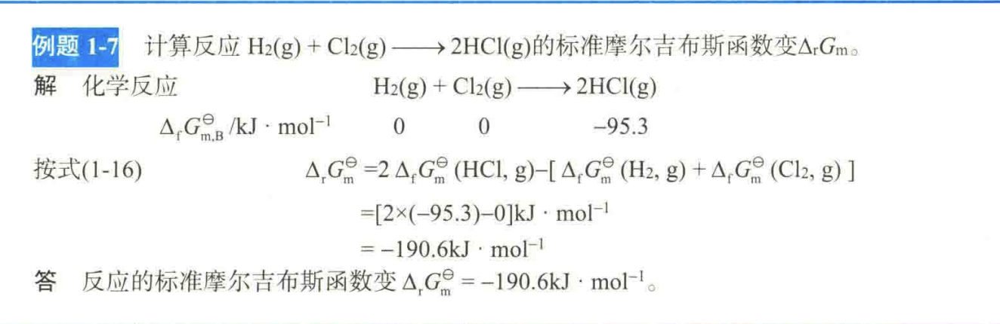
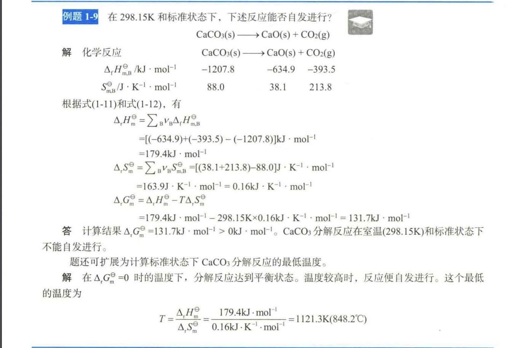
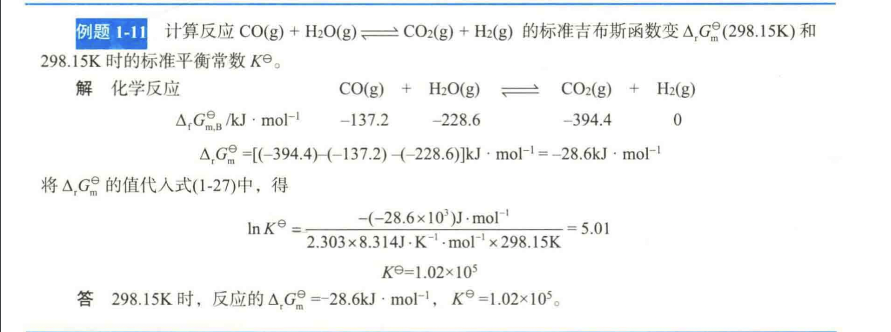

# chemistry

# Several basic concepts

## System and environment

The concepts of "system" and "environment" are fundamental to understanding chemical reactions and the exchange of energy and matter. Here's an explanation of these concepts:

**1. System:**
   - In chemistry, a "system" refers to a specific portion of the universe under consideration. It is the part of the world that we are studying, analyzing, or focusing on. The system can be as small as a single chemical reaction or as large as an entire chemical process.
   - The system is separated from the surrounding universe by a boundary, which can be physical (like a container) or imaginary (such as a control volume in chemical engineering).
   - A system can be an open system, closed system, or isolated system, depending on the exchange of energy and matter with the surroundings.

**2. Environment:**
   - The "environment" refers to everything outside the system. It includes everything not considered as part of the system under study.
   - The environment can exchange energy and matter with the system. This exchange can be crucial in chemical reactions, where reactants and products interact with the environment.

**Types of Systems:**
   - **Open System:** An open system can exchange both energy and matter with its surroundings. For example, a chemical reaction taking place in an open beaker where reactants can evaporate, and heat can be exchanged with the surroundings.

   - **Closed System:** In a closed system, energy can be exchanged with the surroundings (usually in the form of heat), but matter cannot enter or leave. A common example is a sealed container.

   - **Isolated System:** An isolated system can exchange neither energy nor matter with its surroundings. This is an idealized concept and rarely exists in practice. In reality, perfect isolation is challenging to achieve.

Understanding the system-environment relationship is essential in thermodynamics and chemical kinetics, as it helps describe how chemical reactions occur and how energy changes take place. The exchange of heat and matter between the system and its environment is critical in determining the behavior and properties of chemical systems.

2. Phase…

In chemistry, "phase" and "condition" are related but distinct concepts that are used to describe the state of a substance. Here's an explanation of each concept:

**1. Phase:**
- Phase refers to a physically distinct and homogeneous portion of a system with uniform properties. It is characterized by its physical state, such as solid, liquid, gas, plasma, or supercritical fluid. Each phase typically has a well-defined composition, density, and state of matter.

- Phase transitions occur when a substance changes from one phase to another, typically due to changes in temperature and pressure. For example, when water is heated, it transitions from a solid (ice) to a liquid (water) to a gas (vapor).

- Phases are separated by phase boundaries, which are often associated with specific conditions, such as the melting point, boiling point, and critical point. Phase diagrams are used to represent how phases change with variations in temperature and pressure.

**2. Condition:**
- Conditions, in the context of chemistry, refer to the specific environmental factors or parameters under which a substance or chemical reaction is studied. Conditions can include temperature, pressure, concentration, and other variables.

- Conditions are essential for understanding and controlling chemical reactions and processes. For example, reactions may be conducted under specific conditions to optimize yields or to ensure safety.

- Common conditions in chemical experiments include standard temperature and pressure (STP), which is defined as 0°C (273.15 K) and 1 atmosphere (101.3 kPa), and standard ambient temperature and pressure (SATP), which is defined as 25°C (298.15 K) and 1 atmosphere.

- Conditions can also refer to the state of a system, such as "room temperature and pressure" (RT or RTP), which is often used as a standard reference for laboratory conditions. However, the specific values associated with these conditions may vary depending on regional standards.

In summary, phases describe the physical state of a substance (e.g., solid, liquid, gas), while conditions refer to the specific parameters (e.g., temperature, pressure) under which a substance or chemical reaction is observed or conducted. Both concepts are important for understanding the behavior of matter and chemical processes.

# Section 2 Mass Conservation and Energy Conservation in Chemical Reactions
## Law of Conservation of Mass in Chemical Reactions

The Law of Conservation of Mass, also known as the Law of Mass Conservation or simply the Law of Mass, is a fundamental principle in chemistry and physics. It states that in a closed system, the total mass of the substances undergoing a chemical reaction remains constant before and after the reaction. In other words, mass is neither created nor destroyed in a chemical reaction; it is conserved.

Key points related to the Law of Conservation of Mass in chemical reactions:

1. **Mass Before and After:** The total mass of the reactants (substances undergoing the reaction) is equal to the total mass of the products (substances formed as a result of the reaction). This principle is expressed mathematically as:

   $$\[ \text{Mass of Reactants} = \text{Mass of Products} \]$$

2. **Closed System:** The law applies to closed systems, where no mass is exchanged with the surroundings. In practice, it is difficult to have a perfectly closed system, but the law remains a valuable approximation.

3. **Atoms and Molecules:** The law is based on the conservation of atoms and molecules. During a chemical reaction, atoms are rearranged into new compounds, but the total number of atoms of each element on both sides of the reaction equation remains the same.

4. **Chemical Equations:** Chemical reactions are typically represented using balanced chemical equations, which ensure that the number of atoms of each element is the same on both sides of the equation. This balance ensures the conservation of mass.

5. **Mass and Energy:** It's important to note that the law of conservation of mass does not account for changes in energy during a chemical reaction. Some reactions may release or absorb energy (exothermic or endothermic reactions), but this does not violate the conservation of mass.

The Law of Conservation of Mass was formulated by Antoine Lavoisier, a French chemist, in the late 18th century. This law is a foundational concept in chemistry and serves as the basis for stoichiometry, the study of the quantitative relationships between reactants and products in chemical reactions. It is a fundamental principle that underlies much of our understanding of the behavior of matter in chemical systems.

## The first law of thermodynamics,

The First Law of Thermodynamics, often referred to as the Law of Energy Conservation, is one of the fundamental principles in the field of thermodynamics. It states that energy cannot be created or destroyed in an isolated system; it can only change forms or be transferred from one part of the system to another. In simple terms, the total energy of a closed system remains constant.

The First Law can be expressed mathematically as follows:

$$\[ \Delta U = Q - W \]$$

Where:
- $\( \Delta U \)$ represents the change in internal energy of the system.
- $\( Q \)$ represents the heat added to the system (positive when heat is added).
- $\( W \)$ represents the work done by the system on its surroundings (positive when work is done by the system).

Key points related to the First Law of Thermodynamics:

1. **Conservation of Energy:** The First Law is a statement of the conservation of energy principle. It tells us that energy is neither created nor destroyed; it simply changes from one form to another.

2. **Internal Energy:** The change in internal energy $\( \Delta U \)$ is a measure of the total energy within the system, including both kinetic and potential energy. It is an extensive property that depends on the amount of substance in the system.

3. **Heat and Work:** The First Law accounts for the energy transferred as heat and the energy associated with work done by or on the system. Heat $(\( Q \))$ is the energy transfer due to temperature differences, while work $(\( W \))$ is the energy transfer associated with mechanical processes.

4. **Sign Convention:** The sign convention for $\( Q \)$ and $\( W \)$ depends on whether energy is being added to or taken from the system. Heat added to the system and work done by the system are considered positive.

5. **State Function:** The internal energy $(\( U \))$ is a state function, meaning it depends only on the current state of the system and not on the path taken to reach that state.

6. **Applications:** The First Law is fundamental in the study of thermodynamics and is used to analyze a wide range of processes, including chemical reactions, phase changes, and heat engines.

The First Law of Thermodynamics lays the foundation for the study of energy transformations in physical and chemical systems. It helps us understand how energy is conserved and transferred in various processes, making it a crucial principle in the field of thermodynamics.

### Pressure-volume work

Pressure-volume work, often denoted as $\(PV\)$ work, is a type of mechanical work performed by or on a system as a result of a change in its volume while it is under the influence of an external pressure. This concept is a fundamental part of thermodynamics and plays a key role in understanding processes such as gas expansion or compression.

The formula for pressure-volume work $(\(PV\)$ work) is as follows:

$$\[W = -P \Delta V\]$$
$$\(p = -\frac{W}{V_2 - V_1}\)$$

Where:
- $\(W\)$ represents the work done on or by the system.
- $\(P\)$ is the pressure of the system.
- $\(\Delta V\)$ is the change in volume of the system.

Key points related to pressure-volume work:

1. **Sign Convention:** The negative sign in the formula indicates that work is done by the system when it expands $(\(P\)$ is positive, $\(\Delta V\)$ is positive), and work is done on the system when it is compressed $(\(P\)$ is positive, $\(\Delta V\)$ is negative).

2. **Units:** In the International System of Units (SI), pressure is typically measured in pascals (Pa) and volume in cubic meters (m³). Therefore, the unit of pressure-volume work is joules (J), which is the same as the unit of energy.

3. **Expansion and Compression:** When a gas expands, it does work on its surroundings, and this work is considered positive. Conversely, when a gas is compressed, work is done on it, and this work is considered negative.

4. **Work on a Piston:** A common example of pressure-volume work is a piston-cylinder system. When a gas in the cylinder expands and pushes up on the piston, it does work on the surroundings. If the gas is compressed, work is done on it.

5. **Relation to Internal Energy:** In thermodynamics, pressure-volume work is often associated with changes in the internal energy of a system. It is one of the ways in which energy can be transferred between a system and its surroundings.

Pressure-volume work is a fundamental concept in thermodynamics and is used to analyze a wide range of processes, including heat engines, chemical reactions, and the behavior of gases. It helps quantify the energy associated with changes in the volume of a system when pressure is applied or released.

## Heat of reaction of chemical reactions

The heat of reaction, also known as the enthalpy change of a chemical reaction, is a measure of the heat energy either absorbed (endothermic reaction) or released (exothermic reaction) during a chemical reaction. It is a fundamental concept in thermodynamics and is represented by the symbol $\(ΔH\)$, where ΔH stands for the change in enthalpy.

Enthalpy $(\(H\))$ is a thermodynamic property that combines the internal energy of a system with the pressure-volume work done by or on the system. The heat of reaction can be calculated by the following equation:

$$\[ΔH = H_{\text{products}} - H_{\text{reactants}}\]$$

Key points related to the heat of reaction:

1. **Exothermic Reaction:** In an exothermic reaction, the products have lower enthalpy than the reactants. This means that the reaction releases heat energy into the surroundings. ΔH is negative for exothermic reactions.

2. **Endothermic Reaction:** In an endothermic reaction, the products have higher enthalpy than the reactants. This means that the reaction absorbs heat energy from the surroundings. ΔH is positive for endothermic reactions.

3. **Calorimetry:** The heat of reaction can be measured experimentally using calorimetry, where the heat change is determined by measuring temperature changes in a calorimeter.

4. **Standard Enthalpy of Formation (ΔHf°):** The standard heat of reaction, often denoted as ΔHf°, is the enthalpy change for the formation of one mole of a compound from its elements in their standard states. These standard states typically include 25°C and 1 atmosphere of pressure. ΔHf° values are tabulated and provide a way to calculate the heat of reaction for many chemical processes.

5. **Stoichiometry:** The heat of reaction depends on the stoichiometry of the balanced chemical equation. It is typically expressed in units such as joules per mole (J/mol) or kilojoules per mole (kJ/mol).

6. **Applications:** Knowledge of the heat of reaction is critical in various fields, including chemistry, chemical engineering, and material science. It is used to understand and control chemical processes, design chemical reactors, and optimize energy efficiency.

The heat of reaction is a fundamental concept in chemistry, and its measurement and understanding play a key role in both research and practical applications. It is essential for predicting the energy changes associated with chemical reactions and processes.

## Calculation of heat of reaction of chemical reactions

### Gauss's Law
Gauss's Law, as it is traditionally understood, deals with electric fields and electric charges, and it's not directly related to changes in enthalpy or chemical reactions. The equation you've presented, $\(\Delta H_m,1 = \Delta H_m,2 + \Delta H_m,3\)$, doesn't correspond to Gauss's Law. Instead, it seems to be a representation of the principle of conservation of enthalpy in a chemical reaction.

In the context of chemistry, the equation represents the change in enthalpy $(\(\Delta H_m\))$ for a chemical reaction. Enthalpy is a thermodynamic property that accounts for the internal energy of a system plus the pressure-volume work done by or on the system. In a chemical reaction, the change in enthalpy reflects the heat energy either absorbed (endothermic reaction, positive \(\Delta H_m\)) or released (exothermic reaction, negative $\(\Delta H_m\))$ during the reaction.

The equation $\(\Delta H_m,1 = \Delta H_m,2 + \Delta H_m,3\)$ suggests that the change in enthalpy for a particular reaction (1) is equal to the sum of the changes in enthalpy for two separate steps or reactions (2 and 3). This concept aligns with the principle of the conservation of energy, which applies to chemical reactions. In other words, the total change in enthalpy for a reaction is the algebraic sum of the changes in enthalpy for its individual steps.

However, it's essential to recognize that this equation is not a direct application of Gauss's Law, which is specific to the behavior of electric fields and charges. The equation you provided pertains to the thermodynamics of chemical reactions and the principle of conservation of enthalpy, rather than Gauss's Law.

### Formation reaction

The standard molar enthalpy of formation, often denoted as \(ΔH^\circ_f\), is a thermodynamic property that represents the change in enthalpy when one mole of a compound is formed from its elements in their standard states. It is measured under standard conditions, which typically include a temperature of 25°C and a pressure of 1 atmosphere. The standard state for elements is defined as the most stable form of the element at those conditions.

The general form of a standard molar enthalpy of formation reaction is as follows:

$$\[aA + bB + \ldots \rightarrow \text{Compound}\]$$

In this reaction:

- $\(a\), \(b\), etc.$, represent the stoichiometric coefficients of the elements or compounds on the left side of the reaction.
- "Compound" represents the compound for which you want to calculate the \(ΔH^\circ_f\) value.

Key points related to the standard molar enthalpy of formation $\(ΔH^\circ_f\)$:

1. **Standard Conditions:** $\(ΔH^\circ_f\)$ is determined under standard conditions, allowing for consistent comparisons between different compounds. The standard state conditions are defined for temperature, pressure, and the state of the elements.

2. **Enthalpy Change:** A negative $\(ΔH^\circ_f\)$ value indicates that the formation of the compound is exothermic, meaning it releases heat during the formation. A positive value signifies that the formation is endothermic, meaning it absorbs heat.

3. **Reference Point:** The $\(ΔH^\circ_f\)$ values serve as reference points for the energy content and stability of compounds. They are used to calculate the enthalpy change for chemical reactions and to determine the standard enthalpy of reaction $(\(ΔH^\circ_r\))$.

4. **Units:** The standard unit for $\(ΔH^\circ_f\)$ is typically joules per mole (J/mol) or kilojoules per mole (kJ/mol). It can also be expressed in calories per mole (cal/mol).

5. **Data Tables:** $\(ΔH^\circ_f\)$ values for a wide range of compounds are tabulated in thermodynamic data tables, making them readily available for use in thermodynamic calculations.

6. **Applications:** $\(ΔH^\circ_f\)$ values are widely used in chemistry, thermodynamics, and chemical engineering. They are essential for predicting and understanding the energetics of chemical reactions and processes.

Overall, the standard molar enthalpy of formation is a crucial concept in thermodynamics, allowing scientists and engineers to make accurate predictions about the heat changes associated with chemical reactions and to design and optimize chemical processes.

### Calculate standard molar elthalpy 

Certainly! Here's a step-by-step breakdown of the standard molar enthalpy change (\(ΔH^\circ\)) for the reaction:

$$\[CH₄(g) + 2O₂(g) → CO₂(g) + 2H₂O(l)\]$$

We'll break it down into individual formation reactions for each compound involved.

1. **Formation of CO₂(g) from its elements:**
   $\(C(s) + O₂(g) → CO₂(g)\)$
   $\(ΔH^\circ_1 = ΔH^\circ_f(\text{CO₂(g)})\)$

2. **Formation of H₂O(l) from its elements:**
   $\(H₂(g) + 0.5O₂(g) → H₂O(l)\)$
   $\(ΔH^\circ_2 = ΔH^\circ_f(\text{H₂O(l)})\)$

3. **Formation of CH₄(g) from its elements:**
   $\(C(s) + 2H₂(g) → CH₄(g)\)$
   $\(ΔH^\circ_3 = ΔH^\circ_f(\text{CH₄(g)})\)$

Now, let's calculate the \(ΔH^\circ\) for each step. You'll need the standard molar enthalpy of formation values for each compound from thermodynamic tables. These values are typically tabulated in units of kJ/mol.

For example, if you have the following standard molar enthalpy of formation values:

- $\(ΔH^\circ_f(\text{CO₂(g)}) = -393.5 kJ/mol\)$
- $\(ΔH^\circ_f(\text{H₂O(l)}) = -285.8 kJ/mol\)$
- $\(ΔH^\circ_f(\text{CH₄(g)}) = -74.8 kJ/mol\)$

You would use these values to calculate the $\(ΔH^\circ\)$ for each step. Finally, you can add up these values to find the $\(ΔH^\circ\)$ for the total reaction:

$$\[ΔH^\circ_{\text{total}} = ΔH^\circ_1 + ΔH^\circ_2 + ΔH^\circ_3\]$$

Just sum up the values, and you'll have the standard molar enthalpy change for the overall reaction: 

$$\[ΔH^\circ_{\text{total}} = [\(ΔH^\circ_f(\text{CO₂(g)}) + 2\(ΔH^\circ_f(\text{H₂O(l)}) + \(ΔH^\circ_f(\text{CH₄(g)})] = [ -393.5 - 2(-285.8) - 74.8]] = -890.3 KJ/mol$$

We using $2\(ΔH^\circ_f(\text{H₂O(l)})$ beacuse there is $\\text{2H₂O(l)}$.

# Section 3 The direction of chemical reactions

## Spontaneity of chemical reactions

The so-called spontaneous process is a process that can proceed automatically without any external force under certain conditions. The direction in which the reaction proceeds spontaneously refers to the direction in which the reaction proceeds automatically under certain conditions (constant temperature, constant pressure) without the need for external force.

Take physical processes as an example:

- Heat conduction always occurs spontaneously from high-temperature objects to low-temperature objects.
- Water always flows spontaneously from high to low.
- Gases always diffuse spontaneously from high pressure to low pressure.

And they cannot automatically reverse direction without the action of external force. Many similar examples can be given.

Whether a chemical reaction can proceed spontaneously under given conditions and to what extent it proceeds is a very important issue in scientific research and production practice. For example, for the following reaction:

$$\[A \rightleftharpoons B\]$$

If it can be determined that this reaction can spontaneously proceed to the right under given conditions, and to a greater extent, then we can concentrate our efforts on researching and developing catalysts or other means that are beneficial to this reaction to promote the realization of this process. Because this reaction can be used to eliminate the two pollutants CO and NO in automobile exhaust. If it can be proven theoretically that this reaction cannot be realized at any temperature and pressure, there is obviously no need to study how to realize this reaction, and we can instead look for other ways to purify automobile exhaust gas.

On what basis can we judge the spontaneity of a chemical reaction? People have studied a large number of physical and chemical processes and found that all spontaneous processes follow the following rules:

1. From the perspective of energy changes in the process, material systems tend to achieve the lowest energy state.
2. From the analysis of particle distribution and motion state in the system, the material system tends to achieve the maximum degree of chaos.
3. Any spontaneous process can do useful work through certain devices. For example, hydroelectric power generation uses water level differences to do electrical work through generators.

Material systems tend to achieve the lowest energy state, which means that for chemical reactions, exothermic reactions (\(ΔH < 0\)) can proceed spontaneously, which is similar to the situation where water automatically flows from high to low. Therefore, \(ΔH < 0\) is used as a criterion for the spontaneity of chemical reactions.

It seems to make sense. However, some processes, such as the melting of ice and the dissolution of KNO3 in water, are endothermic processes; for example, the decomposition of NzOs is also a strong endothermic reaction. These processes can occur spontaneously. These situations cannot be explained solely by the enthalpy change of the reaction. This is because the spontaneity of chemical reactions depends not only on the important factor of enthalpy change but also on another factor - entropy change.

Another example is the reaction in which CaCO3 decomposes to produce CO2 and CaO:

$$\[CaCO3 \rightarrow CO2 + CaO\]$$

$$\(ΔrH^\circ_m = 179.4 KJ/mol )\$$

It is non-spontaneous at the pressure of 298.15K and 100.000kPa. When the temperature rises to 1114K, the reaction becomes spontaneous. Obviously, the spontaneity of chemical reactions is also related to the temperature of the reaction.

### Chaos and entropy

In chemistry and thermodynamics, the concept of chaos and entropy are closely related. Here's an explanation based on the provided text:

**Chaos (Disorder):**
- Chaos, in the context of thermodynamics, refers to the degree of disorder in the arrangement and movement of particles that make up a system in a specified space.
- If a system has a high degree of order, it exhibits low chaos (low disorder).
- Conversely, if the system lacks order and has a high degree of disorder, it exhibits high chaos.

**Entropy:**
- In thermodynamics, the degree of disorder in a system is quantified using the state function "entropy," denoted by the symbol S.
- Entropy is a measure of the chaos or disorder of particles within a system.
- A system with low entropy values is in a state of low chaos, meaning it is more ordered.
- Conversely, a system with high entropy values is in a state of high chaos, indicating a relatively disordered state.
- Entropy is a property of a system and a state function, which means that its value depends on the system's current state.
- The entropy value changes as the state of the system changes.
- The amount of matter in a system is directly proportional to its entropy value.

**Standard Molar Entropy:**
- The standard molar entropy (S°) is the molar entropy of a substance under standard conditions.
- It is represented by the symbol S°(T), and its unit is J·K^-1·mol^-1.
- The third law of thermodynamics states that at 0 Kelvin (absolute zero), the entropy of any perfect crystal of a pure substance is zero.
- The standard molar entropy data for various substances at 298.15K are listed in tables.
- The standard molar entropy change (ΔS°) for a chemical reaction can be calculated using the standard molar entropies of the reactants and products. It is similar to the calculation of the standard molar enthalpy change.

In summary, chaos or disorder in a system is measured by its entropy. Systems with higher entropy values are more disordered, while those with lower entropy values are more ordered. Entropy is a state function that reflects the degree of chaos or disorder in a system, and it plays a crucial role in thermodynamics and the analysis of chemical reactions.

#### Standard molar entropy

Standard molar entropy (S°) is a thermodynamic property that quantifies the degree of chaos or disorder within a substance at a standard reference state. It is typically represented in units of joules per mole per kelvin (J·K⁻¹·mol⁻¹). Here are some key points about standard molar entropy:

1. **Reference State:** Standard molar entropy is measured under specific standard conditions, which include a pressure of 1 bar (100 kPa) and a temperature of 298.15 K (25°C).

2. **State Function:** Like other thermodynamic properties such as enthalpy and Gibbs free energy, entropy is a state function. This means that its value depends only on the current state of the substance and not on the path taken to reach that state.

3. **Entropy and Disorder:** Entropy is often associated with the degree of disorder or chaos within a system. A substance with a higher standard molar entropy has a greater degree of disorder.

4. **Third Law of Thermodynamics:** According to the third law of thermodynamics, the standard molar entropy of a perfect crystal of a pure substance is zero at absolute zero temperature (0 K). This law provides a reference point for entropy measurements.

5. **Calculation:** The standard molar entropy of a substance is determined by measuring its heat capacity at various temperatures and integrating the data to obtain the entropy change. The entropy of a substance at any temperature can be calculated using this data.

6. **Use in Thermodynamics:** Standard molar entropy is a critical parameter in thermodynamics and is used in various thermodynamic calculations, including those related to Gibbs free energy, equilibrium constants, and chemical reactions.

7. **Comparison:** By comparing the standard molar entropy values of reactants and products in a chemical reaction, you can determine whether the reaction results in an increase or decrease in the degree of disorder (entropy change).

Standard molar entropy values for various substances are tabulated and readily available for use in thermodynamic calculations. These values help chemists and physicists understand the behavior of substances under different conditions and are essential in the study of chemical reactions and phase changes.
#### Calculate ΔSm

The change in molar entropy $(\(ΔS_m\))$ for a chemical reaction can be calculated using the following general equation:

$$\[ΔS_m = ΣS_m(products) - ΣS_m(reactants)\]$$

Where:
- $\(ΔS_m\)$ is the change in molar entropy.
- $\(ΣS_m(products)\)$ is the sum of the standard molar entropies of the products.
- $\(ΣS_m(reactants)\)$ is the sum of the standard molar entropies of the reactants.

Here are the steps to calculate ΔSm:

1. **Identify the Products and Reactants:** Determine the products and reactants involved in the chemical reaction.

2. **Look Up Standard Molar Entropy Values:** Find the standard molar entropy $(\(S_m\))$ values for each of the products and reactants. These values are often tabulated in reference books or online databases. Make sure the values you use are at the same reference state, typically 298.15 K (25°C) and 1 bar (100 kPa) pressure.

3. **Sum the Molar Entropies:** Calculate the sum of the standard molar entropies for the products and reactants, based on the stoichiometric coefficients of the balanced chemical equation. Multiply each molar entropy by its coefficient in the balanced equation and then sum them up.

4. **Calculate $\(ΔS_m\)$:** Subtract the sum of the standard molar entropies of the reactants from the sum of the standard molar entropies of the products. The result is the change in molar entropy for the reaction.

5. **Check Units:** Ensure that the units of the molar entropies are consistent. The result should have units of J·K⁻¹·mol⁻¹.

6. **Account for Phase Changes:** Be aware that phase changes (e.g., solid to liquid, liquid to gas) can significantly affect molar entropy. Include these phase changes in your calculations.

7. **Consider the Third Law of Thermodynamics:** If any of the reactants or products are elemental solids or crystals at absolute zero temperature (0 K), their standard molar entropy is defined as zero. Be sure to account for this.

Calculating $\(ΔS_m\)$ is useful for understanding the entropy changes associated with chemical reactions and their spontaneity. It provides valuable information about whether a reaction tends to proceed in the direction of increased or decreased disorder or chaos.

## Gibbs function change and direction of chemical reaction

The change in Gibbs free energy $(\(ΔG\))$ plays a crucial role in determining the direction of a chemical reaction. Gibbs free energy is a thermodynamic potential that combines the enthalpy $(\(ΔH\))$ and the entropy $(\(ΔS\))$ of a system. The relationship between \(ΔG\), \(ΔH\), and \(ΔS\) is given by the Gibbs-Helmholtz equation:

$$\[ΔG = ΔH - TΔS\]$$

Where:
- $\(ΔG\)$ is the change in Gibbs free energy.
- $\(ΔH\)$ is the change in enthalpy.
- $\(ΔS\)$ is the change in entropy.
- $\(T\)$ is the absolute temperature in Kelvin.

The sign of $\(ΔG\)$ determines the spontaneity and direction of a chemical reaction:

1. **ΔG < 0 (Negative):** If $\(ΔG\)$ is negative, the reaction is said to be "spontaneous" in the forward direction. This means the reaction will tend to proceed from reactants to products without any external intervention. It is an exergonic reaction.

2. **ΔG > 0 (Positive):** If $\(ΔG\)$ is positive, the reaction is "non-spontaneous" in the forward direction. The reverse reaction is favored. Energy must be supplied to make the reaction occur. It is an endergonic reaction.

3. **ΔG = 0:** When $\(ΔG\)$ is zero, the reaction is at equilibrium. There is no net change in the concentrations of reactants and products. The system is in a state of dynamic equilibrium, and the rates of the forward and reverse reactions are equal.

The relationship between $\(ΔG\)$ and the direction of a chemical reaction is summarized in the Gibbs free energy change $(\(ΔG\))$ equation:

$$\[ΔG = ΔH - TΔS\]$$

- If $\(ΔG\)$ is negative (ΔH is negative and TΔS is smaller), the reaction is spontaneous in the forward direction.
- If $\(ΔG\)$ is positive (ΔH is positive and TΔS is larger), the reaction is non-spontaneous in the forward direction.
- If $\(ΔG\)$ is zero (ΔH equals TΔS), the reaction is at equilibrium.

The Gibbs free energy change is a fundamental concept in chemical thermodynamics, helping us understand the direction and spontaneity of chemical reactions. It takes into account both the enthalpy change (heat exchange) and the entropy change (disorder) in a system.

#### Example of calculating ΔG

# Section 4 The extent of chemical reactions - chemical equilibrium

## Chemical equilibrium

### Law of Partial Pressure

When discussing chemical equilibrium, we often encounter a mixture system of several gases. To do this, let's first discuss the law of partial pressure of gases.

#### The Law of Partial Pressure

In a gas-phase reaction, the reactants and products are in the same gas mixture. At this time, the molecules of each component gas will collide with the wall of the container and generate pressure. This pressure is called the partial pressure of the component gas. For an ideal gas, the partial pressure of a component gas is equal to the pressure produced when the component gas alone occupies the same volume as the gas mixture under isothermal conditions. Under appropriate conditions, real gases can be approximately regarded as ideal gases.

For example, a container with a volume of 1 L contains a gas mixture consisting of N2 and O2. If the O2 in this container is removed, the remaining pressure is 79 kPa; if the N2 in the container is removed, the remaining O2 pressure is 21 kPa. Then the partial pressure of N2 in the above gas mixture is p(N2) = 79 kPa, and the partial pressure of O2 is p(O2) = 21 kPa.

When several different gases are mixed into a gas mixture, the total pressure of the gas mixture is equal to the sum of the partial pressures of the component gases (for example, in the above example, the total pressure of the gas in the container is 100 kPa). This is Dalton's Law of Partial Pressure of Gas, proposed by J. Dalton in 1807.

#### Ideal Gas Mixture

Consider an ideal gas mixture containing two components A and B. Among them, the amount of substance in component A is $n_A\$, and component B is amount of substance is $n_s$. Under constant temperature and constant volume conditions, their respective equations of state are:

$\[p_aV = n_aRT\]$

$\[p_bV = n_bRT\]$

or just:

$\[pV = nRT\]$

Here's what each symbol represents in this equation:

- **p**: The pressure of a gas (in pascals, Pa).
- **V**: The volume of the gas (in cubic meters, m³).
- **$n_a$**: The number of moles of a specific component of the gas (sometimes represented as $n_1$ or $n_A$).
- **R**: The ideal gas constant, approximately 8.314 J/(mol·K) (joules per mole-kelvin).
- **T**: The absolute temperature of the gas (in kelvin, K).

This equation is similar to the ideal gas law, which relates the pressure, volume, number of moles, gas constant, and temperature of an ideal gas. However, in your equation, it specifies the number of moles for a particular component of the gas, represented as n_a. This can be useful when dealing with gas mixtures to analyze the behavior of individual gas components.

### Standard equilibrium constant
The standard equilibrium constant, often denoted as $\(K^\circ\)$, is a thermodynamic constant that describes the equilibrium position of a chemical reaction at standard conditions. It is used to quantitatively express the extent to which a chemical reaction proceeds at equilibrium. The standard conditions typically refer to a temperature of 298.15 K (25°C) and a pressure of 1 bar (100 kPa).

The standard equilibrium constant is defined for a chemical reaction in the following general form:

$$\[aA + bB \rightleftharpoons cC + dD\]$$

Where:
- $\(a\)$, $\(b\)$, $\(c\)$, and $\(d\)$ are the stoichiometric coefficients of the reactants (A and B) and products (C and D) in the balanced chemical equation.
- $\(K^\circ\)$ is the standard equilibrium constant for this reaction.

The expression for the standard equilibrium constant, $\(K^\circ\)$, is based on the law of mass action and is given by:

$$\[K^\circ = \frac{{[C]^c [D]^d}}{{[A]^a [B]^b}}\]$$

In this equation, square brackets $\([ ]\)$ denote the molar concentrations of the species involved in the reaction. Note that the standard equilibrium constant is dimensionless, as the concentrations are typically expressed in moles per liter (M or mol/L).

The value of $\(K^\circ\)$ provides important information about the position of the equilibrium for a specific reaction at standard conditions:

1. If $\(K^\circ > 1\)$, it indicates that the equilibrium position lies far to the right, favoring the products (C and D).
2. If $\(K^\circ < 1\)$, it suggests that the equilibrium position is shifted to the left, favoring the reactants (A and B).
3. If $\(K^\circ = 1\)$, it implies that the concentrations of the products and reactants are roughly equal at equilibrium.

The standard equilibrium constant is particularly useful for comparing the relative equilibrium positions of different reactions and for predicting the direction in which a reaction will proceed to reach equilibrium. It is a fundamental concept in chemical thermodynamics and plays a key role in understanding chemical equilibria.

### Examples

#### First example

Certainly, I can provide an example of how to calculate the standard equilibrium constant (K) for a chemical reaction. Let's consider the following reaction:

$$N2(g) + 3H2(g) ⇌ 2NH3(g)$$

This is the balanced equation for the synthesis of ammonia (NH3) from nitrogen (N2) and hydrogen (H2) gases. The standard equilibrium constant (K) for this reaction is expressed as follows:

$$K = [NH3]^2 / ([N2] * [H2]^3)$$

Where:
- $[NH3]$, $[N2]$, and $[H2]$ represent the molar concentrations of ammonia, nitrogen, and hydrogen, respectively.

To calculate K at a specific temperature (usually 298 K or 25°C), you would need the molar concentrations of these gases at equilibrium.

Suppose, at 298 K, the molar concentrations at equilibrium are as follows:
$[NH3] = 1.5 M (moles per liter)$
$[N2] = 0.2 M$
$[H2] = 0.5 M$

Now, you can plug these values into the equation to calculate K:

$K = (1.5)^2 / (0.2 * (0.5)^3)$

$K = 2.25 / (0.2 * 0.125)$

$K = 2.25 / 0.025$

$K = 90$

So, at 298 K, the standard equilibrium constant (K) for this reaction is equal to 90.

This value of K indicates that, at equilibrium and at 298 K, the reaction favors the formation of ammonia (NH3), as K is much greater than 1.

#### Second example

Certainly, here's an example of how to calculate the standard equilibrium constant (K) for a different chemical reaction:

Let's consider the reaction between carbon monoxide (CO) and hydrogen gas (H2) to produce methanol (CH3OH):

$$CO(g) + 2H2(g) ⇌ CH3OH(g)$$

The standard equilibrium constant (K) for this reaction is given by:

$$K = [CH3OH] / ([CO] * [H2]^2)$$

Suppose, at a certain temperature, the molar concentrations at equilibrium are as follows:

$[CH3OH] = 0.05 M$
$[CO] = 0.1 M$
$[H2] = 0.2 M$

Now, let's calculate K:

$K = 0.05 / (0.1 * 0.2^2)$
$K = 0.05 / (0.1 * 0.04)$
$K = 0.05 / 0.004$
$K = 12.5$

So, at that specific temperature, the standard equilibrium constant (K) for this reaction is equal to 12.5. This indicates that the equilibrium significantly favors the formation of methanol (CH3OH) under those conditions.

#### Example from book

### Gibbs's function and G&K relationship 

Certainly, let's discuss the relationship between the standard Gibbs function change (ΔG°) and the standard equilibrium constant (K) for a chemical reaction.

The standard Gibbs function change (ΔG°) is a thermodynamic property that describes the change in the Gibbs free energy of a chemical system during a reaction under standard conditions (usually at 25°C and 1 atm pressure). The Gibbs free energy change for a chemical reaction is a key factor in determining whether a reaction is spontaneous or non-spontaneous.

The standard equilibrium constant (K) is a measure of the extent to which a chemical reaction proceeds to reach equilibrium under standard conditions. It is related to the concentrations of products and reactants at equilibrium. The expression for K depends on the balanced chemical equation for the reaction.

The relationship between ΔG° and K can be expressed as follows:

$$ΔG_m°(T)° = -RT * ln(K)$$

$$ln(K) = -ΔG_m°(T) / RT$$

$$lg(K) = -ΔG_m°(T) / 2.303RT$$

$$ΔG_m°(T) = -RT ln(K°) + RT ln(Пв(p_B/p°)^v_B)$$

Where:
- $ΔG°$ is the standard Gibbs free energy change.
- $R$ is the ideal gas constant (8.314 J/(mol·K) or 0.008314 kJ/(mol·K)).
- $T$ is the temperature in Kelvin.
- $K$ is the standard equilibrium constant.
- $Пв$ represents the vapor pressure.
- $v_B$ represents the coefficient of the component B in the balanced chemical equation (moles of B).

This equation tells us that the sign of $ΔG°$ determines the spontaneity of a reaction:
- If $ΔG° < 0 (negative)$, the reaction is spontaneous, and $K > 1$.
- If $ΔG° = 0$, the reaction is at equilibrium, and $K = 1$.
- If $ΔG° > 0 (positive)$, the reaction is non-spontaneous, and $K < 1$.

In other words, the standard Gibbs free energy change for a reaction is related to the position of the equilibrium (as indicated by K). If ΔG° is negative, the reaction will proceed in the forward direction (toward products) to reach equilibrium. If ΔG° is positive, the reverse reaction is favored.

So, the standard Gibbs function change and the standard equilibrium constant are related through the equation mentioned above, which helps us understand the spontaneity and direction of chemical reactions under standard conditions.

### Examples of Gibbs function calculation

#### First example

Sure, I'll provide an example of how to calculate the standard Gibbs function change (ΔG°) and the standard equilibrium constant (K) for a chemical reaction.

**Example: The Decomposition of Hydrogen Peroxide**
Let's consider the decomposition of hydrogen peroxide (H₂O₂) into water (H₂O) and oxygen (O₂):

2 H₂O₂(l) ⇌ 2 H₂O(l) + O₂(g)

We want to calculate ΔG° and K for this reaction at 25°C (298.15 K).

**Step 1: Calculate ΔG°**
To calculate ΔG°, we use the following equation:

$$ΔG° = ΣΔG°f(products) - ΣΔG°f(reactants)$$

1. The standard Gibbs free energy of formation (ΔG°f) values for water and oxygen are known:
   - $ΔG°f(H₂O) = -237.1 kJ/mol$
   - $ΔG°f(O₂) = 0 kJ/mol$ (since O₂ in its standard state has ΔG°f = 0)

2. The standard Gibbs free energy of formation of hydrogen peroxide is not explicitly provided, but we can look it up in tables. It is approximately -118.6 kJ/mol.

Now we can calculate ΔG°:

$ΔG° = [2 * ΔG°f(H₂O) + ΔG°f(O₂)] - [2 * ΔG°f(H₂O₂)]$
$ΔG° = [2 * (-237.1 kJ/mol) + 0 kJ/mol] - [2 * (-118.6 kJ/mol)]$
$ΔG° ≈ (-474.2 kJ/mol) - (-237.2 kJ/mol)$
$ΔG° ≈ -237 kJ/mol$

**Step 2: Calculate K**
To calculate K, we use the equation:

$$ΔG° = -RT * ln(K)$$

R is the ideal gas constant (8.314 J/(mol·K)), and T is the temperature in Kelvin (298.15 K). ΔG° is already calculated as -237 kJ/mol.

$-237 kJ/mol = - (8.314 J/(mol·K) * 298.15 K) * ln(K)$

Now, solve for ln(K):

$ln(K) = (237,000 J) / [(8.314 J/(mol·K) * 298.15 K)]$
$ln(K) ≈ 31.44$

Finally, calculate K by taking the exponential of ln(K):

$K = e^(ln(K))$
$K ≈ e^(31.44)$
$K ≈ 1.41 x 10^13$

So, for the decomposition of hydrogen peroxide at 25°C, K is approximately 1.41 x 10^13, indicating that the reaction strongly favors the formation of water and oxygen.

This example demonstrates how to calculate ΔG° and K for a chemical reaction under standard conditions. The values of ΔG°f for reactants and products are essential for such calculations.
#### Example from book

## Shifts in chemical equilibrium

The process of converting a reversible reaction from one equilibrium state to another due to changes in external conditions is called a shift in chemical equilibrium. When the system moves from an old equilibrium state to a new equilibrium state, the concentration of each substance is different from the original equilibrium state. Therefore, the equilibrium movement can be judged by the changes in concentration (partial pressure) in the two equilibrium states:

- If the concentration (partial pressure) of the reactant is greater than when the equilibrium is destroyed, it is defined as the equilibrium moving in the direction of the forward reaction (or to the right).
- If the concentration (partial pressure) of the reactant is greater than when the equilibrium is destroyed, it is defined as equilibrium moving in the opposite reaction direction (or to the left).

### The Influence of Partial Pressure and Total Pressure on Chemical Equilibrium

The premise for studying how the chemical equilibrium moves due to the partial pressure or total pressure of the component gases in a gas reaction system is that the temperature remains constant. In this way, the standard equilibrium constant (K) is an unchanging fixed value.

If a certain reactant is added to the original equilibrium system, the reaction will proceed in the forward direction, that is, the equilibrium will move to the right. Conversely, if a certain product is added to the original equilibrium system, the reaction will proceed in the reverse direction, that is, equilibrium will move to the left. This situation can be confirmed by quantitative calculations.

# Section 5 Chemical Reaction Rate
.25
How to express the rate of chemical reaction·
.25
2. Reaction rate theory and activation energy
-27
3. Factors affecting the rate of chemical reactions,
.28
